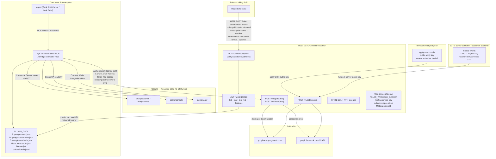

# PRODUCT-DESIGN.md — DGTL Sunrise marketing-agent platform

| Field | Value |
| --- | --- |
| **Document** | Canonical product + systems design for the DGTL marketing-agent platform |
| **Author** | DGTL Sunrise product design (Grok Build) |
| **Date** | 2026-09-04 |
| **Status** | **LOCKED** 2026-09-03 PT · Plan (not Implemented) · Build approve (0 open) · merged with Cursor Phase 0 |
| **Publisher** | DGTL Sunrise (Sunrise Consulting LLC) |
| **Contact** | noel@dgtlsunrise.com |
| **Package** | `dgtl-connector` 0.1.0, Apache-2.0 |
| **Git** | Private `dgtlsunrise/dgtl-connector`; Origin `noel-churchill/dgtl-marketing` |
| **Homepage** | https://www.dgtlsunrise.com/ (`plugin.json` today is `https://dgtlsunrise.com` without `www` — honesty PR aligns it) |
| **Privacy** | https://www.dgtlsunrise.com/privacy |
| **GCP project of record** | `dgtl-marketing-oauth-20260903` (559563115308). Ignore `dgtl-marketing-507517` for the plugin client. |
| **Supersession** | `docs/ops/FULL-STACK-ACCELERATE.md` (locked 2026-09-03) + this design + `ARCHITECTURE-LOCK.md` + `plugin.json` win over stale copies. Explicitly: they **win over `docs/V2_HOSTED.md`’s second MCP server** and over `docs/PRODUCT.md` lock #6 (Connect card as published stdio auth). `docs/ARCHITECTURE.md` is the vendored cloud spec; LOCK overrides it on auth, paid topology, and packaging. |

This is a plan-only document. It does not create Polar products, OAuth clients, Worker deploys, GitHub remotes, or secrets. It does not contact clients. Fixtures and examples stay synthetic (`Example Brand`, `sc-domain:example.com`). Internal delayed-funding work is a **case study only**; do not copy institution names into fixtures, skills, or code comments. Event names in product language: **`apply` / `funded`**.


## Lock record (2026-09-03 PT)

- **Grok Build** (`grok-4.6`, high effort): multi-round design + review → **approve, 0 open issues**. Source: `/workspace/dgtl-planning/PRODUCT-DESIGN.md`.
- **Cursor cloud agent** (`grok-4.6`, xhigh): Phase 0 `PRODUCT-DESIGN.md` on hosted-lane agent `bc-c86e0d58-769c-4811-af4d-a0c27a65cdca` (trust diagrams, Consent A/W/C, list→pick→mutate, Polar JWT, one Worker). Aligned; Build doc is the **canonical** implementer contract (frozen APIs, PR plan, plugin-path honesty).
- **Operator outline**: `DESIGN-OUTLINE-OPERATOR.md` (agency isolation, support-without-tokens, kill switches) — complementary; does not override this file.
- **Open questions**: `OPEN-QUESTIONS.md` — Noel-only; silent → use recommended defaults.
- **Implementation rule:** No P1+ code until Noel names a phase. Free Consent A demo/verification stays on the free-path calendar. Do not put write/publish/`adwords` on the free Desktop client.

---

## Overview

DGTL Sunrise ships a **marketing-engineer workforce in the user’s agent**, not a dashboard with a chat box. The free lane is a local stdio MCP plugin (`dgtl-connector`) that reads the user’s own GA4, Search Console, and Tag Manager on the user’s Bot computer under **Consent A** (`analytics.readonly`, `webmasters.readonly`, `tagmanager.readonly` + `openid` / `userinfo.email`). DGTL never sees those report bytes and never holds those refresh tokens. The paid lane is **DGTL-hosted infrastructure** that a public plugin cannot hold: Polar billing, an allowlisted Ads/Meta gateway, server-side GTM / delayed conversions, and a later token vault. Writes (GTM edit/publish, explicit GSC mutations) use a **separate Consent W OAuth client**. Paid Ads/Meta **user** OAuth is a **separate Consent C** Google client plus a Meta Login for Business app — never bolted onto the free Desktop client used for Google verification.

The architecture is already one-shot in the plugin repo (`/workspace/dgtl-google-plugin/`): 23 closed free tools, gated families that fail closed, AuthPort (host-injected token then installed-app PKCE), local Ed25519 license JWT verification, Consent W stubs behind `DGTL_WRITES_ENABLED`. This document is the product contract for finishing that architecture without a rewrite: honest marketplace listing **before** submit, least-privilege consents A/W/B/C, gated mutations on a write HTTP client, Polar entitlement ≠ credential, and a Worker under `services/stamp/` that attaches DGTL-owned secrets. Sequencing is Consent A verification → free marketplace listing → Polar + gateway → Consent W writes → sGTM → vault/ACL.

---

## 1. Vision & business goals

**Product sentence:** Agents that **do** marketing work, with gates — list properties, pick, run reports, propose GTM changes, dry-run, wait for confirm, then mutate. Not a chat UI over dashboards. Not Ryze-style autopilot.

DGTL is a **marketing-engineer / agent workforce**. The plugin is the calling card and the daily instrument. Inbound consulting is a consequence of being useful and public, not a pitch glued to every how-to (`docs/SUPPORT_AND_CLIENTS.md`). Paid hosted is infrastructure plus liability (Ads developer-token, Meta app secret, conversion pipes, vault), priced as professional/agency infrastructure — **not** a $5–10 wedge in front of `ga4_run_report`.

### Business goals

| Goal | How the product serves it |
| --- | --- |
| Be the first-party-shaped Google marketing connector that Cursor / Grok Bot / Grok Build do not ship | Closed typed tools, AuthPort, skills that refuse hallucinated metrics and silent property pick |
| Free funnel that is actually free | Consent A GA4/GSC/GTM readonly forever local; Polar never gates those tools |
| Charge only where DGTL must operate infrastructure | Polar Pro → JWT `features` unlock Ads/Meta **tools**; gateway holds secrets; sGTM/vault/writes as later SKUs |
| Demonstrate how DGTL thinks about Google marketing data | First-party, least privilege, no silent client mixing, honest API limits, labeled resource IDs |
| Operate (later) as an engagement | Same plugin the client can install; access via **their** Google share or a vault invite — never “forward the refresh token” |
| Survive Google / Meta / marketplace review | Separate consents, readonly demo video, no secrets in git, listing promises match Consent A only |

### Funnel (honest)

```text
Install free plugin (stdio MCP)
  → AuthPort: host-injected token or PKCE Consent A
  → list → pick → report / GTM audit
  → (optional, after a real support answer) one engagement line
  → (optional) Polar Pro → portal fetch of DGTL_LICENSE_JWT
  → Consent C Google Ads OAuth + Meta Login (separate clients)
  → Ads/Meta via gateway (recipe + params; never a URL)
  → (optional, later) Consent W writes, sGTM, vault
```

Free users never need a DGTL account. Paid users need Polar + a JWT; they still do not paste Ads developer-tokens unless they are a documented power-user (designed, not implemented now).

---

## 2. Non-goals (what we refuse)

| Refuse | Why |
| --- | --- |
| Dashboards-with-chat; “ask your GA4” as a BI product | Voice is agents that **do** work with gates |
| Ryze-style silent autopilot (bid changes, budget pacing, multi-network writes without confirm) | Liability + product identity |
| Bolting write / `adwords` / `business.manage` onto Consent A Desktop | Google verification of the free client; tomorrow’s demo is readonly. **Still forbidden even if it would unblock the gateway.** |
| Charging for local `ga4_run_report` / free GSC / free GTM read | Pricing lock in `FULL-STACK-ACCELERATE.md` |
| DGTL proxy of GA4/GSC/GTM report bytes | Free-lane trust boundary |
| Putting Ads `developer-token` or Meta app secret in the public plugin, git, or JWT | Theft + ToS; gateway Option A |
| Collecting refresh tokens, `DGTL_LICENSE_JWT`, or HARs with `Authorization` as support | `SUPPORT_AND_CLIENTS.md` |
| Polar license-key strings as `DGTL_LICENSE_JWT` | Plugin verifies Ed25519 `iss=dgtl-sunrise` only; Polar keys will not verify |
| Whop as billing SoR | Polar is billing SoR |
| Kitchen-sink mega-tool (`run_any_google_json`) | Closed catalog; quality over dump |
| Gmail, Drive, Calendar, Sheets, TikTok, Shopify, HubSpot, LinkedIn Ads, Microsoft Ads | First-party plugins exist; not this product |
| Request-indexing, GA4 realtime/funnel/pivot/batch in v1 | Quota + complexity |
| Blanket `analytics` scope | Never; `analytics.edit` only if Admin mutations ship |
| Pre-declaring “future enhancement” scopes on the verified client | Google rejects this |
| Marketplace listing that promises Ads, writes, or GBP live | Listing = Consent A only; hosted is a second surface |
| Token-as-support; “grant DGTL’s Google account” as diagnosis | Engagement is a separate contract |
| Outbound to named bank clients; using those names in examples | Internal delayed-funding path is a **case study only** |
| Inventing prices, SLAs, or JWT feature strings as locked | Noel decisions; see Open Questions |
| Agent spend: Polar products, OAuth clients, Worker production deploys, GitHub remotes, secret minting | Noel-only checklist |
| Plugin sending a target URL to the gateway | SSRF; recipe + params only |
| Token-lease of DGTL’s Ads developer-token to the user computer | Lawyer-sized ToS hole (SECOND-OPINION Option B — rejected) |

`docs/PRODUCT.md` lock #6 (Gmail-style Connect card as published auth) is **stale for stdio**. We do not rewrite the plugin to fake a Connect card. Remote-HTTP Connect cards are a **host feature** later, not a plugin identity change.

`docs/V2_HOSTED.md` still describes paid Ads as a **second MCP server** and v1 auth as a Connect card. **This design + `ARCHITECTURE-LOCK.md` put `gads_*` / `meta_*` in the same plugin calling a Worker.** That wins.

---

## 3. Personas & jobs-to-be-done

| Persona | Job | Does not |
| --- | --- | --- |
| **End user** (operator on Grok Bot / Cursor / Grok Build) | Install plugin, authorize **their** Google, pick property/site/container, get reports and GTM audits in the agent | Need a DGTL account for free tools; enable APIs on DGTL’s GCP project; paste tokens |
| **Agency operator** | Same login may see 40 properties; list → pick every time; later: seats + workspace ACL so employees are not the owner login | Get a silent “first property”; cross-join Client A GSC onto Client B GA4; a DGTL ACL in the free plugin; share the owner JWT across employees |
| **Brand client** (the agency’s customer) | Grant Viewer (or equivalent) in **Google**, not a DGTL ACL; see labeled reports; later: engagement with contract + share | Paste refresh tokens; appear in plugin fixtures or skills |
| **Bot / agent** (model using tools + skills) | Call closed tools, obey skills (`select-google-property`, `agency-property-isolation`, `no-hallucinated-metrics`, `gtm-readonly-limits`, `google-marketing-support`) | Invent tools, invent metrics, invent confirm phrases, pick index 0, log tokens |
| **Google reviewer** (OAuth brand + sensitive-scope) | See a readonly demo: consent screen with **only** Consent A, client ID in the URL, list→pick→report, refuse publish on camera. Reviewer may `tools/list` and see write stubs **flagged off, different OAuth client** | See Ads, GBP, or write **scopes** on the Consent A client; see a Connect card that stdio does not have |
| **Meta reviewer** (App Review, later) | See a **clickable** hosted demo (list ad accounts → one insights table), not an MCP-only surface | Approve `ads_management` or a secret-in-plugin design |
| **Polar** (merchant of record) | Hosted checkout; webhooks Polar **documents** (`order.paid`, `order.refunded`, `subscription.active`, `subscription.revoked`, `subscription.canceled`, `subscription.cycled`, `subscription.updated`); never holds DGTL minting secret | Be the plugin’s license verifier; mint EdDSA JWTs |
| **Support** (Noel, future human, or Grok following the support skill) | Diagnose from envelope fields + `google_whoami`; intake table; one optional engagement line after a real answer | Collect tokens or JWTs; pitch on how-tos; mix named-client material into tickets |
| **Noel** (spec owner, GCP/Polar/marketplace/legal) | Name the listing, price Polar, submit verification, create Polar product, apply for Ads token / Meta app / GBP quota, flip git public, approve Worker publish, publish ToS | Be replaced by an agent for logins, spend, or form submits (`docs/ops/NOEL-ONLY-CHECKLIST.md`) |

### Jobs the agent must be able to complete (with gates)

1. “Which Google account is connected?” → `google_whoami` (email, scopes, never bearer).
2. “Sessions by channel last 28 days for Example Brand” → list summaries → user picks `properties/{id}` → `ga4_run_report`.
3. “Top search queries” → GSC `gsc_query_search_analytics` with dimension `query`, not GA4 `searchQuery` (denylist, zero HTTP).
4. “What’s actually on the site?” → `gtm_get_live_container_version`, not workspace drafts.
5. “Propose a GTM tag, then publish” → (later, Consent W) dry-run create → user-typed confirm that includes `GTM-XXXX` → create in workspace → dry-run publish → confirm with publicId → publish.
6. “Campaign performance” → (paid) license JWT with `ads` + Consent C + gateway → `gads_campaign_performance`; free GA4 still works if license missing.
7. “This conversion funded two days after apply” → (paid sGTM) ingest with unique `event_id`, correlate on `application_id`, upload the **funded** row’s `event_id`.

---

## 4. Trust boundaries & data flow

### What DGTL never sees (free lane)

- GA4 / GSC / GTM **report bytes**
- User **refresh tokens** and Consent A **access tokens** (host connector store or `PLUGIN_DATA/google-oauth.json` mode 0600)
- Client lists, property catalogs, or “active client” as a DGTL database
- Ads `developer-token` / Meta app secret (never in plugin, git, JWT, or support tickets)

DGTL **does** own the OAuth **client ID** registration (public identifier) so Google shows a DGTL Sunrise consent screen and DGTL can complete verification. That is not a data plane.

### What DGTL must see (paid lane)

| Must see | Why | Retention posture |
| --- | --- | --- |
| Polar webhook bodies (order / subscription ids, customer id, product id, email for portal notify) | Billing SoR → mint JWT | Polar is SoR; Worker **Cloudflare D1** mint audit (`jti`, product, `exp`), not marketing payloads |
| License JWT claims on gateway requests (`sub`, `jti`, `features`, `exp`, `kid`) | Authorize Ads/Meta/sGTM | Request logs: `jti` + tool + status; not the JWT in long-term storage |
| User Ads/Meta **access token** for the gateway hop | Google `Authorization` + Meta Graph; Worker attaches `developer-token` / `appsecret_proof` | **Hop-scoped memory only; do not persist; do not log.** Privacy policy must say this for **paid Ads/Meta only** |
| Ads/Meta **response bytes** in transit | Gateway is a credential plane; bytes transit DGTL | **No storage, no analytics warehouse** (Option A in `SECOND-OPINION.md`) |
| sGTM conversion events (`event_id`, `application_id`, measurement IDs, hashed ids, `apply`/`funded` state) | Delayed conversion upload | Per-client binding; no raw PII in logs |
| Later vault: employee-bound Google tokens + seat credentials | Agency seats ≠ owner login / owner JWT | Encrypted at rest, audit on access, never in plugin binary |

Entitlement ≠ credential: a valid JWT unlocks tools; the Worker still holds DGTL’s developer-token / Meta secret.



Polar is an **HTTP client** of the Worker (`POST /webhooks/polar`). Polar does not mint. The Worker verifies the Standard Webhooks signature, then mints.

### AuthPort (current stdio truth) — Consent A only

Interface `AccessTokenSource` in `src/auth/types.ts`. `AuthPort` in `src/auth/port.ts` — **first match wins**, and this chain is **Consent A only**:

1. **Host-injected** access token (`GOOGLE_ACCESS_TOKEN` and aliases in `src/auth/host-injected.ts`; optional `GOOGLE_GRANTED_SCOPES`, `GOOGLE_ACCOUNT_EMAIL`).
2. **Installed-app PKCE** (`dgtl-connector-mcp auth login`), public Desktop client, tokens in `PLUGIN_DATA/google-oauth.json`. Desktop token exchange currently requires gitignored `GOOGLE_OAUTH_CLIENT_SECRET` — **never commit**. People API must be enabled on the GCP project or Desktop Sign-In returns `invalid_client`.
3. **Never** embed a confidential web-client secret in the binary or git.

There is **no** Gmail-style Connect card for stdio. Agent Plugins 1.0 has no portable OAuth fields. A future **remote HTTP MCP** may use a host Connect card; that is a host feature (second **transport**), not a rewrite of local GA4/GSC/GTM tools, and **not** the paid Ads plane (`V2_HOSTED.md` second-MCP idea is superseded).

PKCE currently requests `CONSENT_A` only (`src/auth/pkce.ts` `buildGoogleAuthUrl`). Consent W and Consent C **must not** use this AuthPort instance.

**Host-injected mixing (required):** If `GOOGLE_ACCESS_TOKEN` happens to include `tagmanager.edit.containers`, `tagmanager.publish`, `adwords`, or `business.manage`, Consent A tools still run **readonly** only because **each A tool builds a fixed URL** — not because `GoogleHttp` enforces a path policy. **Current (0.1.0 `src/http/google.ts`):** host allowlist (`ALLOWED_HOSTS`), methods `GET | POST`, no path allowlist. `tagmanager.googleapis.com` is already allowed; GA4 Data and GSC already POST. Extra scopes on an A token are inert **until** a generic proxy or a W tool reuses `ctx.auth`. **W and C tools must not read `ctx.auth`.** **Proposed (optional, next to PR-8):** deny Tag Manager `POST`/`PUT`/`PATCH` on `GoogleHttp` (A client) so a future generic method cannot mutate on A. Do **not** claim a path allowlist exists in 0.1.0. Dedicated sources:

| Lane | Host-injected env | PKCE store | Client id env |
| --- | --- | --- | --- |
| A (readonly) | `GOOGLE_ACCESS_TOKEN` (+ existing aliases) | `PLUGIN_DATA/google-oauth.json` | `GOOGLE_OAUTH_CLIENT_ID` |
| W (writes) | `GOOGLE_WRITE_ACCESS_TOKEN` | `PLUGIN_DATA/google-oauth-write.json` | `GOOGLE_OAUTH_WRITE_CLIENT_ID` |
| C Google Ads | `GOOGLE_ADS_ACCESS_TOKEN` | `PLUGIN_DATA/google-oauth-ads.json` | `GOOGLE_OAUTH_ADS_CLIENT_ID` |
| Meta user | `META_ACCESS_TOKEN` | `PLUGIN_DATA/meta-oauth.json` | `META_APP_ID` (public) |

A W/C tool that only has the A AuthPort returns `CONSENT_W_REQUIRED` / `ADS_SCOPE_MISSING` / `META_NOT_CONNECTED` — it does **not** silently use the A token even if scopes overlap.

---

## 5. Consent matrix A / W / C — scopes, clients, verification order, failure modes

### Matrix

| Consent | Client | Scopes (exact) | Where tokens live | Tools | Flag / fail |
| --- | --- | --- | --- | --- | --- |
| **A** — free readonly | Existing Desktop app on `dgtl-marketing-oauth-20260903` | `https://www.googleapis.com/auth/analytics.readonly`<br>`https://www.googleapis.com/auth/webmasters.readonly`<br>`https://www.googleapis.com/auth/tagmanager.readonly`<br>`openid`<br>`https://www.googleapis.com/auth/userinfo.email` | Host store or `PLUGIN_DATA/google-oauth.json` | 23 free tools in `schemas/v1/catalog.json` | Missing scope → `CONSENT_MISSING`; no token → `UNAUTHENTICATED` |
| **W** — writes | **Separate** OAuth client. Env: `GOOGLE_OAUTH_WRITE_CLIENT_ID` / `GOOGLE_OAUTH_WRITE_CLIENT_SECRET` (gitignored). Same GCP project **or** sibling — OQ 8 | Candidates in `CONSENT_W` (`src/google/scopes.ts`); **pick per tool, do not request unused**:<br>`tagmanager.edit.containers`<br>`tagmanager.publish`<br>`webmasters` (not `.readonly`) for explicit sitemap/inspect mutations<br>`analytics.edit` **only if** Admin mutations ship; **never** blanket `analytics` | `PLUGIN_DATA/google-oauth-write.json` or `GOOGLE_WRITE_ACCESS_TOKEN`. Do not overwrite A store | Stubs today: `gtm_create_tag`, `gtm_update_tag`, `gtm_publish_container` (`src/google/gtm-write.ts`). Live HTTP via **`GoogleWriteHttp`**, not `GoogleHttp` | `DGTL_WRITES_ENABLED` default false → `WRITE_NOT_ENABLED`; flag on but client/scopes missing → `CONSENT_W_REQUIRED` |
| **B** — GBP | Not on Consent A. Scope `https://www.googleapis.com/auth/business.manage` | Commercially free; technically gated. Quota 0 until Basic API Access | Local, when enabled | `gbp_list_accounts`, `gbp_list_locations`, `gbp_get_location`, `gbp_performance`, `gbp_search_keywords` | `DGTL_GBP_ENABLED` default false → `GBP_NOT_ENABLED`. Readonly tools only; posts/replies → `UNSUPPORTED_OPERATION` |
| **C** — Ads / Meta **user** OAuth | **Separate Google OAuth client** (not A, not W) + **Meta Login for Business app**. DGTL Ads developer-token and Meta **app secret** stay on the Worker | Google: `https://www.googleapis.com/auth/adwords` (the only Ads OAuth scope; user-visible string is read/write — readonly is **tool + Reporting token + user role**, not a narrower scope).<br>Meta: `ads_read`; `business_management` only if listing requires it at implementation time; **no** `ads_management` for v1 paid readonly | **Recommended (OQ 19):** Google Ads user tokens local (`PLUGIN_DATA/google-oauth-ads.json` / `GOOGLE_ADS_ACCESS_TOKEN`). Meta: short-lived user token on box; **Worker-side** long-lived exchange (app secret). Hop-scoped access token sent to gateway; **not stored on Worker** | `gads_*`, `meta_*` registered, fail closed | No/invalid JWT → `LICENSE_REQUIRED`; JWT ok, gateway URL unset/down → **`GATEWAY_UNAVAILABLE`** (versioned, same PR as gateway client); JWT ok, gateway up, Ads user OAuth missing → `ADS_SCOPE_MISSING`; Meta missing → `META_NOT_CONNECTED` |

`CONSENT_W` is **never** merged into `CONSENT_A`. Tests in `tests/consent-w.test.ts` lock that invariant. **`adwords` is never added to Consent A**, even to “unblock” the gateway (kill criterion 1).

Identity: do **not** request `userinfo.profile` unless a later spec proves a need. Do not request Gmail, Drive, Calendar, or People as product scopes. People API is enabled so **Desktop Sign-In** works; that is not a product consent.

### Consent C — clients, env, refresh (was unspecified)

This is the gap that would have caused an implementer to bolt `adwords` onto the free Desktop client. It is **not** “the gateway is Consent C.” The gateway holds **DGTL** secrets; Consent C is the **user’s** Ads/Meta grant.

| Piece | Spec |
| --- | --- |
| Google Ads OAuth client | New Desktop (or later web) client, **not** the Consent A client. Env: `GOOGLE_OAUTH_ADS_CLIENT_ID` / `GOOGLE_OAUTH_ADS_CLIENT_SECRET` (gitignored). CLI: `dgtl-connector-mcp auth login-ads`. Store: `PLUGIN_DATA/google-oauth-ads.json` mode 0600. **GCP project: OQ 20** (recommended: same org, **sibling** project — do not couple Ads verification to Consent A’s `dgtl-marketing-oauth-20260903`) |
| Meta Login for Business | Meta app claimed by Sunrise Consulting LLC. `META_APP_ID` is public (login URL). `META_APP_SECRET` **Worker env only** |
| Refresh — Google C | Same PKCE refresh as A, against the **C** client id, writing only the C store |
| Meta **stdio grant (v1)** | **Host-injected `META_ACCESS_TOKEN`** when the host can inject (no user paste). Otherwise the **hosted Login page (PR-3b) is the grant origin**: after Facebook Login, Worker issues a **one-time grant code** (TTL minutes, single use) — not a Meta bearer in the URL. Plugin `dgtl-connector-mcp auth login-meta --code` calls `POST /v1/meta/exchange`. Support never collects Meta tokens. Loopback `login-meta` without a hosted redirect is **not** v1 default (Login for Business wants a hosted URI) |
| Meta exchange (frozen) | See `MetaExchangeRequest` / `MetaExchangeResponse` below. Plugin sends license JWT + short-lived token **or** one-time grant code. Worker uses app secret, returns **long-lived user token to the plugin**, **stores nothing**. Plugin writes `PLUGIN_DATA/meta-oauth.json` mode 0600 |
| Hosted clickable demo (PR-3b) | **Not fixture HTML.** Real Meta Login + **one live Graph read** (list ad accounts → one insights table) as the App Review tester. Secrets in Worker env. Noel-gated hostname (OQ 16). Same Login app as product Meta OAuth — not a customer vault |
| Plugin → gateway | Hop-scoped **access** token in `X-DGTL-User-Access-Token`. License JWT in `Authorization: Bearer`. Never send refresh tokens to the Worker |

**`POST /v1/meta/exchange` (frozen; not a `GatewayRequest`):**

```text
POST {DGTL_GATEWAY_URL}/v1/meta/exchange
Headers:
  Authorization: Bearer <DGTL_LICENSE_JWT>
  Content-Type: application/json
Body MetaExchangeRequest:
{
  "short_lived_token"?: string,   // from host-injected META_ACCESS_TOKEN
  "grant_code"?: string           // one-time code from hosted Login; exactly one of token|code
}
Response MetaExchangeResponse:
{
  "ok": true,
  "access_token": "<long-lived Meta user token>",
  "expires_in": number,
  "token_type": "bearer"
}
```

Worker: verify JWT `features` includes `meta`; exchange with `META_APP_SECRET`; return token; **do not write Meta tokens to D1/KV**. 4xx if both/neither of token/code; `LICENSE_REQUIRED` / `GATEWAY_UNAVAILABLE` mapped by plugin. Logs: `jti` + status, never the Meta token.

### Google Cloud APIs (Consent A project)

Enabled on the **OAuth client’s** project (publisher work). Production `403 accessNotConfigured` is a **publisher defect** (`ACCESS_NOT_CONFIGURED`).

| API | Service |
| --- | --- |
| Google Analytics Admin API | `analyticsadmin.googleapis.com` |
| Google Analytics Data API | `analyticsdata.googleapis.com` |
| Search Console API | `searchconsole.googleapis.com` |
| Tag Manager API | `tagmanager.googleapis.com` |
| People API | required for Desktop Sign-In; missing → `invalid_client` |

Users grant OAuth and must have **product** access (GA4 Viewer, GSC user, GTM account). Those are different systems from “API Enabled.”

### Verification order (lock)

1. **Consent A** External + sensitive-scope verification (readonly demo; **refuse publish on camera**). Tomorrow’s demo + Google verification apply to **this client only**. Copy: `docs/ops/OAUTH-CONSENT-COPY.md` (must say: publish **tools exist, flagged off, different OAuth client** — not “there is no publish tool”). Script: `docs/ops/DEMO-VIDEO-SCRIPT.md`. Demo must show PKCE / Manual auth (client ID in the URL), not a fake Connect card.
2. **Marketplace listing of the free plugin** (public git, clean secret scan). Listing promises = Consent A only. **Blocked on PR-0 + PR-1** (honesty + write-tool annotations + `catalog.json` gated writes).
3. **Separate OAuth client for Consent W after A is verified.** Never pre-declare write/Ads on A.
4. **Separate Consent C Google client + Meta App Review on the hosted app** (Worker / DGTL MCC / Business app). Ads developer-token application wording: OQ 17.
5. **Do not bolt** `adwords` / `business.manage` onto the free Desktop client.

### Failure modes (closed `error_code`s in `src/errors.ts` today)

| Code | When |
| --- | --- |
| `UNAUTHENTICATED` | No host-injected token and empty PKCE store (Consent A) |
| `REAUTH_REQUIRED` | Expired / revoked Google access |
| `CONSENT_MISSING` | Granular consent unchecked a product scope; include `missing_scope` |
| `ACCESS_NOT_CONFIGURED` | API not Enabled on OAuth client project |
| `PERMISSION_DENIED` | Connected user cannot see that resource |
| `NOT_FOUND` | Unknown ID / GSC URL mismatch / never-published live version |
| `RESOURCE_REQUIRED` | Omitted ID or `default` / `first` / `0` / `""` |
| `INVALID_ARGUMENT` | Bad dates, too many dimensions, Google rejected the body; **or** confirm_phrase does not contain the resolved `GTM-XXXX` |
| `UNSUPPORTED_DIMENSION` | GA4 denylist `searchQuery` / `query` / `searchTerm` / `keyword` — **zero HTTP** (`src/tools/denylist.ts`) |
| `UNSUPPORTED_OPERATION` | Write requested on a readonly path, or non-allowlisted host (`src/http/google.ts`) |
| `QUOTA_EXCEEDED` / `RATE_LIMITED` | Data API tokens, GSC/inspect, 429; **also** gateway 429 → plugin `RATE_LIMITED` |
| `GOOGLE_UNAVAILABLE` | 5xx from Google or unexpected throw in `dispatch` |
| `LICENSE_REQUIRED` | Paid tool without valid Ed25519 JWT (`ads`/`meta` feature) |
| `ADS_SCOPE_MISSING` | License **and** gateway OK; **user** Ads OAuth (`adwords`) not connected. **Not** “gateway URL unset” |
| `META_NOT_CONNECTED` | License **and** gateway OK; Meta user OAuth not connected. **Not** “gateway URL unset” |
| `GBP_NOT_ENABLED` | Flag off or live GBP HTTP not in binary |
| `WRITE_NOT_ENABLED` | `DGTL_WRITES_ENABLED` false |
| `CONSENT_W_REQUIRED` | Writes flag on but Consent W client/scopes/runtime missing |

**Until the gateway-client PR lands, keep today’s fail-closed path** (`LICENSE_REQUIRED` then `ADS_SCOPE_MISSING` meaning “Ads runtime not in this binary”). Do **not** overload `ADS_SCOPE_MISSING` for a missing `DGTL_GATEWAY_URL` — that mis-instructs `license-and-reconnect` to “Reconnect Ads.”

**Proposed versioned codes** (each lands with `src/errors.ts` + `schemas/v1/error.schema.json` + `docs/ERRORS.md` in the **same** PR; not in 0.1.0):

| Proposed code | When | Lands in |
| --- | --- | --- |
| `GATEWAY_UNAVAILABLE` | JWT `ads`/`meta` valid, but `DGTL_GATEWAY_URL` unset, Worker 5xx, or global pause | PR-5 |
| `SPEND_CAP_EXCEEDED` | Per-workspace spend cap hit **before** Ads/Meta mutate API | with first spend tool (not P4 readonly) |
| `SGTM_QUARANTINED` | optional; ingest accepted but quarantined | PR-9 or later |

Envelope (every tool, `src/envelope.ts` **today**): `ok`, `tool`, `resource {type,id,display_name}`, `data`, `page {next_page_token, truncated, row_count}`, `quota`, `error_code`, `message`, `hint`, `google_status`, `google_reason`, `api`. Closed JSON Schema (`additionalProperties: false`). Empty rows are `ok: true`. Paid tools **stay in** `tools/list` and fail closed. Success schema has **no** `request_id` slot — **do not add it** without a versioned property on both envelope and error schemas. Day-1 `request_id` is **log-only** (stderr / audit jsonl).

---

## 6. Permission & approval model

Pattern: **list → pick → mutate**. Tools are not a security boundary by themselves; required IDs in code + skills + (later) hosted ACL.

### Read path (shipped)

1. `google_whoami` — which email, which scopes. **Today** returns email, sub, granted_scopes, expires_in, token_source, connections, license `{ok, features, exp}` — **not** plugin version, host, `jti`, or `gateway.reachable` (`src/google/whoami.ts`). Those fields are PR-2b, not current.
2. List (`ga4_list_account_summaries` preferred for agencies).
3. If `length != 1`, **stop**. Never index 0. `RESOURCE_REQUIRED` on `default`/`first`/`0`.
4. User names the ID. Echo canonical form (`properties/{id}`, exact GSC `siteUrl`, GTM `GTM-XXXX`).
5. Data tool. Answer header names the resource. No cross-client join unless the user named **both** IDs.
6. Do not persist a sticky default client in `PLUGIN_DATA` without an explicit user action in that conversation.

Skills: `select-google-property`, `agency-property-isolation`. Isolation in v1 is **operational**, not a DGTL ACL. Google OAuth sees everything that login can already see. Support line: “limit visibility in Google, not in DGTL free plugin.”

### Write path (Consent W) — local control plane

Stubs: `gtm_create_tag`, `gtm_update_tag`, `gtm_publish_container` in `src/tools/registry.ts`. They are **not** yet in `schemas/v1/catalog.json` `gated_tools` — PR-1 adds them with `fail: WRITE_NOT_ENABLED` before marketplace listing.

**HTTP gate is not “POST on tagmanager.”** `GoogleHttp` already POSTs for GA4 Data and GSC searchanalytics/inspect; it allowlists **hosts**, not paths, and uses Consent A `AuthPort`. `tagmanager.googleapis.com` is already allowed for A GETs. Enabling POST does not bind writes to the W token.

**`GoogleWriteHttp`** (new, PR-7/PR-8):

- Token source: Consent W only (`GOOGLE_WRITE_ACCESS_TOKEN` or write PKCE store). **Never** `ctx.auth`.
- Host: `tagmanager.googleapis.com` only (first ship).
- Method + **path prefix** allowlist (examples; pin exact Tag Manager v2 paths in the PR):
  - `POST` `.../workspaces/{workspaceId}/tags` (create)
  - `PUT` `.../workspaces/{workspaceId}/tags/{tagId}` (update)
  - `POST` `.../workspaces/{workspaceId}:create_version` / publish-version path
- Any other path → `UNSUPPORTED_OPERATION`, zero mutate.

| Step | Rule |
| --- | --- |
| Gate 0 | `DGTL_WRITES_ENABLED` else `WRITE_NOT_ENABLED` (zero HTTP) |
| Gate 1 | Consent W client + W token source else `CONSENT_W_REQUIRED` |
| Gate 2 | Required `account_id` / `container_id` / `workspace_id` / `tag_id` — same picker as reads |
| Dry-run | **Default `true` in code** (`src/tools/schemas.ts` + handler), not only in prose. Dry-run returns the proposed body + `GTM-XXXX` + workspace name, no Google mutate |
| Confirm (v1 local) | Live mutate (`dry_run=false`) requires `confirm_phrase` that **includes the container `publicId`**. Handler resolves `container_id` → `publicId`, then `INVALID_ARGUMENT` if the phrase does not contain that publicId. **Do not put the expected phrase in the tool `description`.** Constant `PUBLISH` alone is not a control |
| Confirm vs list-tool leak | `gtm_list_containers` still returns `GTM-XXXX` in the same thread; a model can paste it. **Skill + tests (PR-1 / PR-8):** live mutate (`dry_run=false`) without a **user** message **this turn** that contains that publicId is a **fail** (eval/harness), not only string-contains on the tool arg. Residual until dual-control (OQ 6); accept it, do not pretend the phrase is unguessable |
| Hosted `Approval` | **Not required** for local W first ship (OQ 9 default). `dry_run_hash` / time-boxed `Approval` is a Worker record for later vault/spend dual-control |
| Workspace vs live | Create/update hit **workspace**. Publish is the irreversible step. Skills must say which |
| MCP annotations | Today `createMcpServer` stamps `readOnlyHint: true` on **all** tools (`src/server.ts`) including publish — a marketplace/verification defect. PR-1: per-tool `readOnlyHint: false`, `destructiveHint: true` on publish, `idempotentHint: false` |
| Skill update | `skills/gtm-readonly-limits/SKILL.md` currently refuses all publish. PR-1: refuse when flag off; when on, follow dry-run + publicId confirm — never invent the phrase; never treat list-tool output as the user message |

GSC writes (sitemap submit) and GA4 Admin (`analytics.edit`) are **out until** a named tool + Consent W subset ships. No request-indexing tool.

### Spend path (hosted, later — not P4 readonly)

Separate from GTM publish. P4 Ads/Meta are **readonly**.

| Gate | Rule |
| --- | --- |
| License | JWT feature `ads` / `meta` |
| Gateway | Allowlisted; mutate GAQL / spend tools rejected unless a **named** mutate family ships |
| Budget ceiling | Per-workspace spend cap on Worker; block **before** API → `SPEND_CAP_EXCEEDED` (versioned) |
| Confirm | Phrase names customer id + action + amount; dry-run first |
| Dual-control | Optional later for agency seats (OQ 6). Solo operator: off |
| Autopilot | **Off.** No time-based bid robots in v1 paid |

Proposed gateway QPS (Noel may change the number; the **code** is locked): **30 requests / minute / `jti`**. Excess → HTTP 429 → plugin `RATE_LIMITED`. One `jti`, many IPs over a short window → **tripwire: stop mint + existing JWT remains until `exp`** (no denylist required in v1). Numeric cap is proposed, not a Polar price.

### Audit

| Lane | What | Where |
| --- | --- | --- |
| Free/local | Optional `PLUGIN_DATA/audit.jsonl` behind **proposed** `DGTL_AUDIT_LOCAL`: ts, **log-only `request_id`**, tool, resource type/id, `error_code`, duration — **not** tokens, not report rows, not JWT | Never shipped to DGTL |
| Hosted | actor, workspace (from JWT `sub`), client, tool, resource IDs, outcome, request id, `jti` | Worker logs / D1 audit table |
| Spend/publish (later hosted) | Immutable append including approval id | Same hosted log |

Retention default is OQ 7 (recommended 90 days hosted). Local file is user-managed.

Hosted `Approval` (vault/spend later — **not** local W):

```text
Approval {
  id, created_at, expires_at,
  actor, workspace_id, client_id,
  tool, resource {type,id,display_name},
  action, dry_run_hash, confirm_phrase_used,
  estimated_spend?, reversible: bool,
  status: pending | confirmed | expired | denied
}
```

---

## 7. Product surface map: free plugin tools vs paid hosted SKUs

### Free plugin (marketplace listing)

Surface: local stdio MCP, command `./bin/dgtl-connector-mcp` (plugin-relative, **no npx**). Dual-emit `mcp.json` / `.mcp.json` from `src/packaging/mcp.template.json`.

**Closed free kernel (23)** — bump version + `schemas/v1/catalog.json` to add a 24th:

| Group | Tools |
| --- | --- |
| identity | `google_whoami` |
| ga4-admin | `ga4_list_accounts`, `ga4_list_account_summaries`, `ga4_list_properties`, `ga4_get_property`, `ga4_list_data_streams`, `ga4_list_key_events` |
| ga4-data | `ga4_get_metadata`, `ga4_run_report` |
| gsc | `gsc_list_sites`, `gsc_get_site`, `gsc_query_search_analytics`, `gsc_inspect_url`, `gsc_list_sitemaps`, `gsc_get_sitemap` |
| gtm | `gtm_list_accounts`, `gtm_list_containers`, `gtm_get_container`, `gtm_list_workspaces`, `gtm_list_tags`, `gtm_list_triggers`, `gtm_list_variables`, `gtm_get_live_container_version` |

Invariants: no implicit resource; `ga4_run_report` denylists search-query dimensions with zero HTTP; empty rows `ok: true`; `returnPropertyQuota: true`; default limit 50, max 1000; date range 366 days unless `allow_long_range`.

**Registered, fail closed (not promised on the listing):**

| Family | Tools | Fail | Catalog today |
| --- | --- | --- | --- |
| gbp | 5 tools | `GBP_NOT_ENABLED` | in `gated_tools` |
| gads | `gads_list_accessible_customers`, `gads_get_customer`, `gads_search` (closed recipe enum — model never sends raw GAQL), `gads_campaign_performance` | `LICENSE_REQUIRED` then (after gateway PR) `GATEWAY_UNAVAILABLE` / `ADS_SCOPE_MISSING` | in `gated_tools` |
| meta | `meta_list_ad_accounts`, `meta_list_campaigns`, `meta_list_adsets`, `meta_list_ads`, `meta_insights`, `meta_get_creative` | `LICENSE_REQUIRED` then `GATEWAY_UNAVAILABLE` / `META_NOT_CONNECTED` | in `gated_tools` |
| license | `license_status` | always callable | in `gated_tools` (`fail: null`) |
| gtm-write | `gtm_create_tag`, `gtm_update_tag`, `gtm_publish_container` | `WRITE_NOT_ENABLED` / `CONSENT_W_REQUIRED` | **missing from `catalog.json` today** — add in PR-1 |

`license_status` **today** (`src/ads/gads.ts`): `{ ok, features, exp, sub, reason, gateway: { reachable: false, note } }` — **no** `jti`, **no** plugin version. `PLUGIN_VERSION` is MCP server version + `dgtl-connector-mcp --version` only. Support intake still asks the user for plugin version until PR-2b.

Skills (10): `select-google-property`, `agency-property-isolation`, `ga4-report-recipes`, `no-hallucinated-metrics`, `gsc-vs-ga4-search`, `gtm-readonly-limits`, `google-marketing-support`, `license-and-reconnect`, `gsc-vs-ads-keywords`, `ga4-vs-ads-conversions`.

### Paid hosted SKUs (`services/stamp/` — not this package)

Worker tree is scaffolded at **exactly one path: `/workspace/dgtl-planning/services/stamp/`**. Name `services/stamp/` matches `ARCHITECTURE-LOCK.md`. **Must never** live under the public plugin root (`/workspace/dgtl-google-plugin/`). Marketplace tarball must not contain Worker code. Noel creates any git remote later. Intended runtime: Cloudflare Worker on a DGTL hostname Noel publishes.

| SKU | What the customer buys | JWT `features` (v1 locked vs later) | Plugin behavior |
| --- | --- | --- | --- |
| **Polar Pro (gateway)** | Ads + Meta readonly via allowlisted gateway | v1 locked: `["ads","meta"]` (`src/license/verify.ts` `hasFeature`) | Valid JWT → stop `LICENSE_REQUIRED`; still need gateway URL + Consent C / Meta user OAuth |
| **sGTM / delayed conversions** | First-party ingest + server container or Worker equivalent; Ads + Meta CAPI upload | **OQ 3** — reserved candidate `sgtm`; do not mint until a Polar product exists | Free plugin never hosts pixels or bank-like pipes |
| **Writes entitlement** | Product permission to use Consent W tools (and later hosted dual-control) | **OQ 3** — reserved `writes`. Technical flag `DGTL_WRITES_ENABLED` is independent today | Entitlement ≠ Google credential |
| **Vault / agency seats** | Encrypted token vault, workspace ACL, employee seats, seat credentials | **OQ 3** — reserved `vault` | Picker-only until this SKU |

**Honesty table (marketplace vs hosted):**

| | Marketplace plugin | Hosted SKU |
| --- | --- | --- |
| Surface | stdio MCP, free 23 tools, Consent A | gateway, sGTM, vault, write entitlements |
| Auth | AuthPort (local A tokens) | DGTL account + Polar + Consent C + gateway creds |
| Secrets | none in package | Worker env only |
| Price | free forever for GA4/GSC/GTM | infra/liability — not $5–10; **number is Noel’s** |
| Fail | local errors | `LICENSE_REQUIRED` / `GATEWAY_UNAVAILABLE`; **free tools unaffected** |

Polar product packaging is OQ 2. Recommended: **one Pro product** that mints `["ads","meta"]`. Worker env `POLAR_PRODUCT_ID_PRO` — **default deny** if unset or unknown. Never bake a live Polar product id into git.

### License JWT

**Plugin verify today** (`src/license/verify.ts`): `alg === EdDSA`; issuer checked **only if `iss` present** (`if (payload.iss && payload.iss !== LICENSE_ISSUER)`); **missing `exp` never expires**; **no `kid`**. That is a mint-bug footgun. Fixes:

**Mint Worker MUST set** (refuse to emit otherwise): `kid`, `iss=dgtl-sunrise`, `sub`, `jti`, `iat`, `exp`, `features` (non-empty array). Missing `iss` or `exp` at mint = **no JWT**. Prefer Polar `current_period_end` for `exp`.

**Verifier (versioned plugin change, same PR as mint contract or immediately after):** treat missing `iss` / missing `exp` as `reason: "invalid"`. Check `kid` against embedded key(s). Unknown extra claims still ignored.

**Rotation:** `kid` in JWT header from day 1 (even with one key). Worker KV maps `kid` → public key. Emergency: mint with new kid; plugin embeds current + previous public keys for a short overlap; bump plugin; then retire old kid. A leak of the minting private key is not recoverable by `exp` alone if verify accepts missing `exp` — hence the verifier change.

Other rules (unchanged): load from `DGTL_LICENSE_JWT` or `PLUGIN_DATA/license.jwt`; plugin **never networks Polar**; no Google/Ads/Meta secrets in the JWT; Polar license-key string ≠ JWT; v1 revocation = short `exp` + remint; denylist later optional.

**Delivery (OQ 18):** Prefer Polar checkout **success URL / customer portal** (session- or one-time-code gated) over emailing a bearer. Email may notify “license ready — open this link.” Support never intakes the JWT.

Polar webhook subscribe list (**Polar-documented**, confirm in PR-4 against https://polar.sh/docs/integrate/webhooks/events — do not invent names, do not copy `POLAR-LICENSE-PLAN.md` blindly):

| Event | Action |
| --- | --- |
| `order.paid` | Mint (prefer over `order.created`; created can still be pending) |
| `order.refunded` | Stop mint |
| `subscription.active` | Mint / ensure JWT |
| `subscription.revoked` | Stop mint |
| `subscription.canceled` | Stop mint (access may last until `current_period_end`) |
| `subscription.cycled` | **Remint** — Polar fires this on a new billing period (documented 2026-08). Extend `exp` to new `current_period_end` |
| `subscription.updated` | Catch-all. Remint **only if** `current_period_end` moved; otherwise ignore |

Format Raw; Standard Webhooks signature via `POLAR_WEBHOOK_SECRET`. If Polar’s catalog at implement time drops a name, drop it in PR-4 — do not keep a ghost event.

**Delivery API (frozen; OQ 18 default = portal, not email bearer):**

```text
# Polar checkout success URL (Noel hosts on dgtlsunrise.com):
#   https://www.dgtlsunrise.com/license?checkout_id={CHECKOUT_ID}
# Page JS POSTs the id in the JSON body (never put code/JWT in the query):

POST {DGTL_GATEWAY_URL}/v1/license
Headers:
  Content-Type: application/json
  Accept: application/json
  Cache-Control: no-store
Body (exactly one of):
  { "checkout_id": "<polar_checkout_id>" }
  { "code": "<one-time-code>" }
Response:
  { "ok": true, "token": "<DGTL_LICENSE_JWT>", "exp": number, "features": ["ads","meta"] }
Cache-Control: no-store
```

**Store vs redeem (do not hash the JWT):**

- Mint-audit D1 row (on `order.paid` / `subscription.active`): `jti`, `sub`, `iat`, `exp`, `features`, `kid`, `order_id` / `checkout_id`. **No JWT plaintext, no `sha256(jwt)`.** A hash cannot be redeemed.
- Redeem row: **`code_hash`** (hash of the one-time code, not the JWT) + `checkout_id` + `expires_at` (TTL **15 minutes**) + `used_at` (null until redeem) + FK to mint-audit `jti`.
- `POST /v1/license`: constant-time check of `code` against `code_hash` (or lookup `checkout_id`); refuse if expired or `used_at` set; **re-mint** the JWT from the mint-audit row with the **same** `jti` / `exp` / `features` / `kid` / `sub`; set `used_at`; return token once. Second redeem → 404.
- Do **not** persist JWT ciphertext unless a later PR proves a need; if ciphertext is ever stored, wrap with a Worker secret and **delete it after successful redeem**. Hash is for the **code**, not the JWT.
- **Never** put JWT, `code`, or `checkout_id` in query strings on the Worker. Polar’s success URL may carry `checkout_id` on the **page** URL; the page JS **POST**s it. Worker access logs **redact** `code` / `checkout_id` / `token`. Logs: `jti` + status only.
- Email (if any): “your license is ready — open this link,” no bearer.
- PR-3 stubs `POST /v1/license` (401 without body). PR-4 implements mint-audit + re-mint redeem. PR-0: `POLAR-LICENSE-PLAN.md` portal not email.

### Gateway (Option A) — frozen hop contract

Plugin calls gateway **only when** `hasFeature(ads|meta)` **and** `DGTL_GATEWAY_URL` is set. Plugin sends **recipe + params, never a URL**.

```text
POST {DGTL_GATEWAY_URL}/v1/gads/{tool}
POST {DGTL_GATEWAY_URL}/v1/meta/{tool}

Headers:
  Authorization: Bearer <DGTL_LICENSE_JWT>     // entitlement only
  X-DGTL-User-Access-Token: <user access token> // hop-scoped; never logged; never stored
  X-DGTL-Request-Id: <uuid>                    // equals plugin log request_id
  Content-Type: application/json
  Accept: application/json
  // Do not mix Google Bearer into Authorization.

GatewayRequest (JSON, additionalProperties false):
{
  "tool": "gads_search" | "gads_campaign_performance" | "gads_list_accessible_customers"
        | "gads_get_customer" | "meta_list_ad_accounts" | "meta_list_campaigns"
        | "meta_list_adsets" | "meta_list_ads" | "meta_insights" | "meta_get_creative",
  "recipe": "campaigns" | "ad_groups" | "keywords" | "search_terms"
          | "conversion_actions" | "change_status" | "policy_topics" | "performance" | null,
  "params": {
    "customer_id"?: string,
    "login_customer_id"?: string,
    "date_range"?: { "start_date": string, "end_date": string },
    "where"?: { "status"?: string, "campaign_id"?: string },
    "limit"?: number,
    "ad_account_id"?: string,
    "object_id"?: string,
    "level"?: "account" | "campaign" | "adset" | "ad",
    "date_start"?: string,
    "date_stop"?: string,
    "creative_id"?: string
  }
}

GatewayResponse (JSON): same closed envelope fields the plugin already maps
  (ok, tool, resource, data, page, quota, error_code, message, hint,
   google_status, google_reason, api).
Plugin copies into the MCP envelope. No extra properties.
```

Timeouts / limits (proposed): Worker 25s (under CF 30s); max request body **256 KiB**; reject `params` that look like URLs (`http://`, `https://`) with 400.

**Worker allowlist** (host + method + path prefix + recipe — host-only is not enough). **Do not freeze Ads/Graph version numbers in this product contract.** Pin the **latest stable** Ads API and Graph version in Worker config **at implement time** (PR-6 writes the full prefixes). The **plugin never sends the version**.

| API | Host | Method | Path prefix (version from Worker config) | Allowed tools / recipes |
| --- | --- | --- | --- | --- |
| Google Ads search | `googleads.googleapis.com` | POST | `/{adsVersion}/customers/{id}:googleAds.search` | `gads_search` closed recipe enum only; GAQL built server-side; reject non-SELECT / mutate |
| Google Ads list customers | `googleads.googleapis.com` | GET | `/{adsVersion}/customers:listAccessibleCustomers` | `gads_list_accessible_customers` |
| Google Ads customer get | `googleads.googleapis.com` | GET | `/{adsVersion}/customers/{id}` | `gads_get_customer` |
| Meta Graph read | `graph.facebook.com` | GET | `/{graphVersion}/me/adaccounts`, `/{graphVersion}/act_{id}/campaigns`, `/{graphVersion}/act_{id}/adsets`, `/{graphVersion}/act_{id}/ads`, `/{graphVersion}/{id}/insights`, `/{graphVersion}/{creative_id}` | matching `meta_*` tools |
| Meta CAPI (sGTM only) | `graph.facebook.com` | POST | `/{graphVersion}/{pixel_or_dataset_id}/events` | sGTM upload, not plugin tools |
| Ads offline conversions (sGTM only) | `googleads.googleapis.com` | POST | conversion upload path pinned in Worker config | sGTM `funded` only |

Anything else (including a client-supplied URL) → 403, no fetch. Attach `developer-token` / `appsecret_proof` **only after** JWT verify. User token used as Google/Meta `Authorization` for the hop, then discarded.

Power-user `DGTL_ADS_DEVELOPER_TOKEN`: designed bypass, license still required, **not implemented now** (OQ 12).

### Worker persistence (proposed — pick in PR-3, not “later ops”)

Cloudflare Workers are ephemeral. Durable state is required. **Cloudflare D1** below is SQL. It is **not** Noel-only checklist items **D1–D2** (sGTM first-customer shape / hostname publish in `NOEL-ONLY-CHECKLIST.md`).

| Object | Proposed store | Notes |
| --- | --- | --- |
| Polar product id → `features` | KV | Key from `POLAR_PRODUCT_ID_PRO`; default deny |
| Mint audit / idempotency (`order_id`, `jti`) | **Cloudflare D1** | Unique on `order_id`; no remint spam |
| JWT `kid` → public key | KV | Rotation |
| Global pause / gateway flag | KV | Fail closed |
| Mint-audit (`jti`,`sub`,`exp`,`features`,`kid`) | **Cloudflare D1** | No JWT plaintext; no hash-of-JWT |
| One-time license redeem | Cloudflare D1 | `code_hash` + `checkout_id` + TTL + `used_at`; re-mint on redeem |
| `ConversionEvent` | **Cloudflare D1** | PK `event_id` |
| sGTM quarantine + upload retry | Queues → D1 | |
| `Workspace` / `ClientBinding` / `Seat` | Cloudflare D1 | v1: 1 Polar customer = 1 workspace |
| Per-client funded ingest secret + public apply key (hashes) | Cloudflare D1 on `ClientBinding` | funded secret never in browser; plaintext shown once at bind |
| Secrets | Worker secrets | never D1/KV values |

PR-3 includes this table in the Worker README and a `wrangler.toml` **without** secrets.

### sGTM / delayed conversions (paid only)

Internal case-study pattern (do not plan outbound; do not copy institution names into fixtures): browser `apply` → later `funded` → Ads + Meta CAPI.

**Ingest is not the plugin.** The browser **never** sends `DGTL_LICENSE_JWT`. Two keys per `ClientBinding` — the **funded** secret must not appear in a web GTM variable or browser pixel (Measurement-Protocol-in-JS shape).

| Key | Holder | Authorizes | Header |
| --- | --- | --- | --- |
| **Funded ingest secret** | **Server only**: sGTM **server** container env or customer backend | `funded` (and server-side `apply` if used) | `X-DGTL-Ingest-Key` |
| **Public apply key** | Browser / web GTM (rate-limited) | `apply` **only** | `X-DGTL-Apply-Key` |

`funded` with the apply/public key → **403, zero Ads/Meta upload**. Stolen page key cannot mint conversions.

```text
POST {DGTL_GATEWAY_URL}/v1/sgtm/ingest
Headers:
  X-DGTL-Ingest-Key: <server-only funded secret>   // funded (and server apply)
  // or
  X-DGTL-Apply-Key: <public apply key>            // apply only; rate-limited
  Content-Type: application/json
  // NEVER Authorization: Bearer <DGTL_LICENSE_JWT>
  // NEVER X-DGTL-Ingest-Key from a browser pixel
Body:
{
  "event_id": "<uuid>",
  "application_id": "<client-stable>",
  "client_id": "<dgtl client id>",
  "event_name": "apply" | "funded",
  ...
}
```

Worker: constant-time compare of the presented key → load `ClientBinding`. **`workspace_id` comes from that binding**, not from a JWT `sub`. If `client_id` in the body does not match, or the key is unknown → **401/403, no upload**. If `event_name=funded` and the key is the apply/public key → **403**. Unbound `client_id` is rejected. Rotate secrets (plaintext shown once at bind; D1 stores hashes). Funded secret never ships in the public plugin.

| Requirement | Design |
| --- | --- |
| Ingest auth | Server-only funded secret vs public apply key. Browser never sends license JWT or funded ingest key |
| Workspace derivation | From `ClientBinding` lookup, **not** JWT `sub` |
| Ingest PK | Client `event_id` (UUIDv4) is **unique per ingest row**. Worker inserts; retry with same `event_id` is idempotent upsert of **that** row only |
| Correlation | `application_id` (client-stable) links `apply` → later `funded`. They are **two rows** |
| Closed `event_name` | `apply` \| `funded` only in v1 |
| Upload identity | Ads/Meta `event_id` = the **funded** row’s `event_id` (or dedicated `upload_event_id` copied from it). Never upload the apply row as the conversion |
| Consent / state machine | Per row: `received → consented → mapped → uploaded → acknowledged \| quarantined`. No upload if `ad_storage` denied |
| Replay-safe | At-least-once with server-side dedup on funded `event_id` |
| Per-client binding | Binding → measurement ID, Ads conversion action, Meta dataset/pixel, sGTM container, **funded ingest_key_hash + apply_key_hash** — **no shared default pixel** |
| Lag observability | Ingest→upload delay; drop reasons enum; last-success watermark — **no raw PII** |
| Quarantine | Schema fail, unknown measurement id, missing consent, duplicate after ack, **bad ingest key** → Queue or 401, not silent drop |

```text
ConversionEvent {
  event_id,            // PK, unique ingest
  application_id,      // correlation apply ↔ funded
  upload_event_id,     // set on funded; sent to Ads/Meta
  workspace_id,        // from ClientBinding, not JWT, not plugin param
  client_id,           // must match binding for this ingest key
  event_name,          // apply | funded
  event_time,
  consent: { ad_storage, analytics_storage },
  ids: { gclid?, wbraid?, gbraid?, fbp?, fbc?, em_sha256? },
  value?, currency?,
  state, ads_upload_id?, meta_upload_id?
}
```

Free plugin never hosts this endpoint. Browser → ingest **apply** with public apply key only. **sGTM server container / customer backend** → ingest `funded` with `X-DGTL-Ingest-Key`. PR-9 tests: missing key, wrong key, unbound `client_id`, **`funded` with apply/public key** — all fail closed, zero Ads/Meta upload.

---

## 8. Support & client onboarding

Rules live in `docs/SUPPORT_AND_CLIENTS.md` and `skills/google-marketing-support/SKILL.md`. They are product law.

### Support

- Answer the actual failure first.
- **Never** collect refresh tokens, access tokens, `client_secret`, `token.json`, cookie dumps, HARs with `Authorization`, or **`DGTL_LICENSE_JWT`**. On paste: instruct revoke (Google Account → Third-party access) + rotate if it was a client secret; **do not store**; confirm “I did not paste tokens.”
- Diagnose with envelope fields + `google_whoami` scopes — not “send me token.json.”
- Never pitch on every how-to. After a **real** answer, **at most one** optional line, once per conversation, verbatim:

> DGTL Sunrise can also run GA4, Search Console, and Tag Manager as a client engagement if you want this operated for you. Email noel@dgtlsunrise.com. The plugin stays free and local either way.

- Do not imply the plugin is incomplete unless they pay.
- Do not pull named-client / bank material into tickets or model context.
- Do not ask them to grant DGTL’s Google account as “support.”

**Intake (only these):** plugin version, host (Grok Bot / Cursor / Grok Build / other), tool, `error_code`, Google HTTP status, `google_reason`, `api`, GA4 `property_id` / GSC `site_url` / GTM ids, connected email (redactable), short repro, confirmation “I did not paste tokens.” Until PR-2b, version is **asked**, not echoed by tools.

Paid-lane extra correlators (never tokens): `jti`, Polar order/subscription id, gateway `request_id`.

### Client onboarding (engagement ≠ support)

| Artifact | Purpose |
| --- | --- |
| Contract | Separate thread/subject; not a condition of plugin help |
| Google share | Client grants DGTL (or named operator) Viewer/standard in **Google** on the named properties |
| Later: vault invite + seat credential | Employee seats; still not “forward refresh token” or share owner JWT |
| Handoff sheet | Canonical IDs: `properties/{id}`, exact `siteUrl`, `GTM-XXXX`, Ads customer id, Meta ad account — synthetic in this repo |
| Measurement binding (sGTM) | Per-client IDs; no default pixel |
| Kill / revoke | Google Third-party access; Polar cancel; DGTL pause switch |

SLAs for paid hosted are **later** (OQ 14). Do not invent uptime numbers in this draft.

---

## 9. Multi-tenant / agency future without painting into a corner

**Now (free plugin):** picker-only. One Google login sees every Viewer property. Isolation = required IDs + labeled envelopes + skills. Kill criteria: silent first-property pick; unlabeled numbers; merging Client A GSC onto Client B GA4.

**Do not** implement a fake ACL in `PLUGIN_DATA` that claims to hide Google-visible properties. That lies.

**v1 paid:** **1 Polar customer = 1 workspace.** For **plugin → gateway** Ads/Meta hops, `workspace_id` is derived from JWT `sub` (Polar customer id). It is **not** a parameter on the 23 free tools. Optional gateway header `X-DGTL-Workspace-Id` may echo the claim for logs; Worker ignores user-supplied values that do not match `sub`. For **sGTM ingest** (no plugin JWT), `workspace_id` is derived from `ClientBinding` via the presented ingest/apply key — never from a license JWT. The **funded** secret is server-held only.

**Seat authn (reserve now, do not mint a `vault` feature):** employees must **not** share the owner JWT (audit actor would be a lie; theft is the whole agency). Reserved credential: Worker-issued short-lived **seat token** (`DGTL_SEAT_TOKEN`) bound to `sub` + `actor` + `sid`, or a later JWT `sid` claim. Gateway `Authorization` in v1 is the license JWT (owner). Seat tokens are a vault-SKU implement; the interface is reserved so PR-5 does not assume “one JWT per human.”

**Durable hosted model (vault SKU):**

```text
Workspace { id = polar_customer_id in v1, display_name, spend_cap, pause_writes }
Seat { workspace_id, actor, role: owner | operator | viewer, sid }
ClientBinding {
  workspace_id, client_id, display_name,
  ga4_property_ids[], gsc_site_urls[], gtm_ids[],
  gads_customer_ids[], meta_ad_account_ids[],
  sgtm: {
    measurement_id, ads_conversion_action_id, meta_dataset_id, container_id,
    ingest_key_hash,  // funded; server-only; never browser / web GTM
    apply_key_hash    // public apply only; cannot authorize funded
  }
}
```

Rules that keep this from forcing a rewrite:

1. Tool params stay **Google resource IDs**. Hosted ACL is an **additional** Worker check (“is this `customer_id` bound to this workspace?”).
2. Envelope `resource` stays `{type,id,display_name}`.
3. JWT `sub` = Polar customer = workspace owner. Seats are Worker data, **not** extra JWT `features` in v1.
4. Employee seats ≠ shared owner Google login and ≠ shared owner JWT.
5. Dual-control is a Worker policy on the workspace, not a plugin rewrite.
6. Free GA4/GSC/GTM **never** require `workspace_id`.

Agency timing is OQ 5. Recommended: **picker-only until vault SKU**; do not block marketplace or Polar Pro on ACL.

---

## 10. Threat model & abuse cases

| Threat | Severity | Path | Mitigation |
| --- | --- | --- | --- |
| Wrong property / client mix | High | Agency login, agent picks index 0 or fuzzy-matches brand | Required IDs in code; `RESOURCE_REQUIRED`; skills stop if `length != 1`; labeled `resource`; no sticky default |
| Autopilot spend | Critical | Agent calls Ads mutate or repeats confirm | No mutate tools in v1 paid; gateway strips mutate; confirm phrase; spend cap → `SPEND_CAP_EXCEEDED`; autopilot off |
| Secret leakage (developer-token / Meta secret / minting key) | Critical | Git, plugin binary, JWT, chat, HAR | Worker env only; `scripts/validate-spec.py`; CI never opens googleapis/token endpoints |
| Consent phishing / scope confusion | High | User grants write/Ads thinking it is the free readonly plugin | Separate A/W/C clients; Consent A demo refuses publish; listing copy readonly |
| Token / JWT paste in support | High | User emails `token.json` or `DGTL_LICENSE_JWT` | Skill + intake; revoke+rotate; do not store |
| License JWT theft | Medium | JWT copied from portal, disk, or (if we emailed it) inbox | Prefer portal fetch (OQ 18); short `exp` + remint; QPS + IP tripwire; JWT has no Google secrets |
| Polar key pasted as JWT | Low | UX confusion | Verifier rejects non-EdDSA / wrong iss; `license_status` reason `invalid` |
| Gateway used as open proxy | Critical | SSRF / client-supplied URL / unbounded Meta path | Recipe+params only; host+method+path+recipe allowlist; reject URL-shaped params |
| Confirm-phrase bypass | High | Agent invents `PUBLISH` or pastes `GTM-XXXX` from `gtm_list_containers` | Phrase must include publicId; expected phrase **not** in tool description; `INVALID_ARGUMENT` on mismatch; **eval: live mutate without a user message this turn containing that publicId is a fail** (residual until dual-control) |
| Dry-run skipped | High | Live mutate on first call | Default `dry_run=true` **in code**; live requires publicId confirm. Hosted `dry_run_hash` is **not** the local W gate |
| GBP write via `business.manage` | Medium | Scope is write-capable | Tools readonly; skills refuse posts; flag default off |
| `adwords` scope is write-capable | High | Google has no ads-readonly OAuth scope | No mutate tools; Reporting+conversion permissible use; user role; `readOnlyHint` |
| Consent A client used for writes or Ads | Critical | “Save a verification round” / unblock gateway | Tests forbid merging W/C scopes into A; kill criterion 1 |
| Host-injected A token with extra scopes used to mutate | High | Single AuthPort reused | `GoogleWriteHttp` / gateway client never use `ctx.auth` |
| sGTM PII leak / double conversion | High | Logs, retries, shared pixel, apply/funded key collision | Hashed ids; `event_id` PK per ingest; `application_id` correlation; upload funded `event_id`; per-client binding |
| Forged sGTM ingest | Critical | Attacker POSTs `funded` with a guessed `client_id` | Per-client **server** ingest secret; reject unbound `client_id`; workspace from binding not JWT; browser never sends `DGTL_LICENSE_JWT` |
| Stolen browser apply key → forged `funded` | Critical | DevTools copies a pixel header that can authorize conversions | Funded secret **never** in web GTM / browser; public apply key cannot authorize `funded`; PR-9: `funded` + apply key → 403 |
| Marketplace binary with secrets | Critical | `.env` committed | Public-git bar; secret scan |
| Immortal JWT | High | Mint omits `exp`; verifier accepts missing exp | Mint refuses missing `iss`/`exp`; versioned verifier treats missing as invalid |
| Seat JWT sharing | High | One Polar JWT for the agency | v1: 1 customer = 1 workspace = owner; reserve seat token; do not share owner JWT |

User kill: Google Third-party access revoke. DGTL kill: Polar stop-mint, JWT expiry, Worker pause, `DGTL_WRITES_ENABLED=false`.

---

## 11. Observability, versioning, feature flags, migrations

### Day-1 instrumentation

**Every tool envelope already carries** `ok`, `error_code`, `hint`, `google_status`, `google_reason`, `api`, `resource`, `quota`, truncation. Keep that contract. **Do not** add `request_id` to the closed envelope in PR-2.

Local stderr log (`src/log.ts`) **today**: `{ts, tool, error_code, api, duration_ms}`. PR-2 extends with log-only `request_id` (uuid per `dispatch`) and resource **type/id**. Never Authorization, never JWT.

**Not current (do not claim shipped):**

- `google_whoami` does **not** return plugin version, host, `jti`, or `gateway.reachable` (`src/google/whoami.ts`).
- `license_status` does **not** return `jti` or plugin version (`src/ads/gads.ts`).
- Counters are **not** implemented. `src/log.ts` has no rolling counters.

PR-2b adds version / host / `jti` / `gateway.reachable` to `whoami` + `license_status` (data payload, not a new envelope property).

**Counters** are **P2+**, not a P1 marketplace blocker. PR-2c: in-process + stderr lines (no extra store). Hosted Worker counters land with PR-3+.

| Counter | Why | When |
| --- | --- | --- |
| `UNAUTHENTICATED` / `REAUTH_REQUIRED` / `CONSENT_MISSING` | Auth health | PR-2c |
| `RESOURCE_REQUIRED` | Agent/skill picker bugs | PR-2c |
| Empty lists vs empty rows | Permission vs no traffic | PR-2c |
| `ACCESS_NOT_CONFIGURED` by `api` | Publisher defect | PR-2c |
| 429 / `QUOTA_EXCEEDED` | User education + our caps | PR-2c |
| Hosted: webhook signature fails, mint failures, gateway 4xx/5xx by tool | Ops without report bodies | PR-3+ |
| sGTM: lag histogram, drop reason, last-success watermark | Support delayed conversions | PR-9 |

Support skill reads envelope fields first; intake form mirrors §8.

### Feature flags / env

| Name | Default | Status | Effect |
| --- | --- | --- | --- |
| `DGTL_GBP_ENABLED` / `GBP_ENABLED` | false | exists (`src/flags.ts`) | else `GBP_NOT_ENABLED` |
| `DGTL_WRITES_ENABLED` / `WRITES_ENABLED` | false | exists | else `WRITE_NOT_ENABLED` |
| `GOOGLE_OAUTH_CLIENT_ID` / `GOOGLE_OAUTH_CLIENT_SECRET` | — | exists; secret gitignored | Consent A Desktop. Checklist item 10 must match STATUS.md: secret **is** required for Desktop `/token`, in `.env` only |
| `GOOGLE_OAUTH_WRITE_CLIENT_ID` / `GOOGLE_OAUTH_WRITE_CLIENT_SECRET` | — | exists as names | Consent W |
| `GOOGLE_ACCESS_TOKEN` (+ aliases) | — | exists | Consent A host-injected |
| `GOOGLE_WRITE_ACCESS_TOKEN` | — | **proposed** | Consent W host-injected; W tools must not use A AuthPort |
| `GOOGLE_OAUTH_ADS_CLIENT_ID` / `GOOGLE_OAUTH_ADS_CLIENT_SECRET` | — | **proposed** | Consent C Google |
| `GOOGLE_ADS_ACCESS_TOKEN` | — | **proposed** | Consent C host-injected |
| `META_APP_ID` | — | **proposed** (public) | Meta Login |
| `META_ACCESS_TOKEN` | — | **proposed** | Meta user token on box |
| `DGTL_LICENSE_JWT` or `PLUGIN_DATA/license.jwt` | — | exists | Local verify |
| `DGTL_GATEWAY_URL` | unset | **proposed** | Gateway client; unset + valid JWT → `GATEWAY_UNAVAILABLE` after PR-5 |
| `DGTL_AUDIT_LOCAL` | false | **proposed** (not in `src/flags.ts` today) | Write `PLUGIN_DATA/audit.jsonl` |
| `DGTL_ADS_DEVELOPER_TOKEN` | unset | **proposed, not implemented** | Power-user bypass (OQ 12) |
| `DGTL_SEAT_TOKEN` | unset | **reserved** | Vault SKU seat authn |
| Worker: `POLAR_WEBHOOK_SECRET`, minting private key, Ads developer-token, Meta app secret, `POLAR_PRODUCT_ID_PRO`, `JWT_KID` | — | Worker only | Default deny unknown Polar product |
| Worker: global pause / per-workspace spend cap | — | Worker KV/D1 | Fail closed; free tools on box unaffected |

### Kill switches

| Switch | Scope | Fail closed |
| --- | --- | --- |
| `DGTL_WRITES_ENABLED` | Consent W tools | `WRITE_NOT_ENABLED` |
| Consent W missing | write stubs | `CONSENT_W_REQUIRED` |
| License JWT missing/exp/invalid/wrong iss / missing iss-exp after verifier fix | ads/meta features | `LICENSE_REQUIRED` |
| `DGTL_GATEWAY_URL` unset / Worker down / global pause | hosted Ads/Meta/sGTM | `GATEWAY_UNAVAILABLE` after PR-5; free tools keep working |
| Per-jti QPS | gateway | plugin `RATE_LIMITED` |
| IP tripwire | mint | stop mint; JWT lives until `exp` |
| Per-workspace spend cap | paid mutate | `SPEND_CAP_EXCEEDED` |
| Polar `order.refunded` / `subscription.revoked` / `subscription.canceled` | minting | stop mint; short `exp` |
| User revoke | Google Third-party access | `REAUTH_REQUIRED` |
| `DGTL_GBP_ENABLED` | GBP | `GBP_NOT_ENABLED` |

### Versioning & migrations

- Package `0.1.0`. Adding a free tool = version bump + catalog + TOOLS.md + tests in one change.
- Closed error catalog versioned with schema. New codes (`GATEWAY_UNAVAILABLE`, `SPEND_CAP_EXCEEDED`, …) are not silent.
- JWT: mint required fields; verifier change for missing `iss`/`exp`; `kid` for rotation; new **feature strings** are Polar + verifier + docs, not a silent mint.
- Consent W live HTTP: `GoogleWriteHttp` + write store; do not reuse Consent A PKCE file or `ctx.auth`.
- Hosted Worker: additive routes; plugin remains useful if Worker is down.
- Do not migrate users onto a DGTL-hosted MCP for GA4. Optional second **transport** for remote-HTTP Connect cards later — not a second Ads MCP (`V2_HOSTED.md` superseded).

---

## 12. Compliance notes

Audience includes **bank-like** clients (internal delayed-funding case study). Design as if a reviewer will ask where bytes go.

### Data residency

No invented region lock in this draft (OQ 7). Honest default: Cloudflare Worker + Polar + Google/Meta — **US-centric subprocessors**. If a client requires EU-only, that is a **contract + Worker region + no US logs** project, not a plugin flag. Do not claim residency we do not have.

### Subprocessors (paid / verification)

| Party | Role | Data | Free plugin? |
| --- | --- | --- | --- |
| **Google** | OAuth + GA4/GSC/GTM/Ads APIs | User’s Google data under their account; DGTL client ID is the app | User→Google direct for A/W/C |
| **Meta** | Ads / CAPI (paid) | Ad account + conversion events via gateway; hop-scoped user token | No |
| **Polar** | Merchant of record / billing | Customer email, order, subscription | No (paid only) |
| **Cloudflare** | Worker host (gateway, mint, sGTM, D1/KV/Queues) | Hop tokens (not stored), conversion events, mint audit | No |
| **xAI / Cursor** | Marketplace / Bot host | Plugin code on user’s computer; host may inject tokens into MCP | Host’s terms; we do not proxy |

Sunrise Consulting LLC is the publisher. Privacy policy URL already live. Update privacy **before** gateway launch to state: paid Ads/Meta **bytes transit** DGTL and are not stored; free GA4/GSC/GTM do not.

### Bank-like constraints

- No raw PII in support tickets or Worker metrics.
- Conversion identifiers hashed when stored.
- Idempotent financial-adjacent events (`funded` row’s `event_id`).
- Access via Google sharing or vault, never token forwarding.
- Internal case study only — no outbound from this workstream to named institutions.
- Fixtures synthetic (`apply` / `funded` only in code).

ToS URL is **OQ 15**. Do not invent legal copy in this repo. OAUTH-CONSENT-COPY currently leaves ToS blank; P1 verification submit waits on Noel’s page.

---

## 13. Phased delivery with proof per phase

Still plan. Agents write code and tests; Noel does logins, Polar, verification, spend. Proof artifacts are named so a phase cannot be “done” by README.

**Phase-order note:** `FULL-STACK-ACCELERATE.md` listed sGTM MVP **then** GTM write/publish live. **This plan does local flagged Consent W first (P5) then sGTM (P6)** so marketplace is not blocked on a conversion pipe, and so write-tool annotations exist **before** P1 listing. JWT feature strings stay `ads`/`meta` until OQ 3.

| Phase | Intent | Proof artifact | Noel gate? |
| --- | --- | --- | --- |
| **P0 — Lock + listing honesty** | Stale-doc pass + marketplace copy + write-tool annotations + catalog gated writes | PR-0 + PR-1 merged; `validate-spec.py` still `tools=23`; write tools in `gated_tools`; no `readOnlyHint` on publish | No |
| **P1 — Consent A public path** | Testers → demo video → Google verification in motion → public git → marketplace | Unlisted YouTube; verification submitted (ToS URL OQ 15); secret scan clean; Cursor submit. **Blocked on P0** | **Yes** (video, submit, flip public) |
| **P2 — Polar mint Worker (sandbox)** | Webhook verify + Ed25519 mint; no live charge until Noel | Unsigned body rejected; `POLAR_PRODUCT_ID_PRO` match → JWT with `kid`+`iss`+`exp`+`jti`+`features=["ads","meta"]`; unknown product → no mint; missing `iss`/`exp` refused at mint; Polar key string rejected | **Yes** (Polar org, product, webhook secret, sandbox purchase) |
| **P3 — Gateway stubs fail-closed** | Frozen `GatewayRequest`/`GatewayResponse`; allowlist; persistence sketch | Missing JWT 401; client-supplied URL 403; recipe-only; Cloudflare D1/KV/Queues named in README | No live Ads token in CI |
| **P4 — Ads/Meta readonly via gateway** | Live hop on DGTL test MCC / BM + Consent C | `gads_list_accessible_customers` + `meta_list_ad_accounts`; free GA4 still works if Worker down; clickable demo (PR-3b) for App Review | **Yes** (Ads token, Meta App Review, demo hostname OQ 16) |
| **P5 — Consent W GTM writes** | Live mutate via `GoogleWriteHttp` + publicId confirm | Flag off zero HTTP; `dry_run` default true; phrase without `GTM-XXXX` → `INVALID_ARGUMENT`; W token ≠ A AuthPort | **Yes** (second OAuth client, later W verification) |
| **P6 — sGTM ingest MVP** | Ingest → `application_id` correlate → upload **funded** `event_id` | Server ingest key required for `funded`; `funded` with apply/public key fails; unbound `client_id` fails; two-row apply/funded fixture; no shared pixel; no JWT / funded key from browser | **Yes** (hostname publish = Noel checklist **D1–D2**, not Cloudflare D1) |
| **P7 — Vault / workspace ACL + seat token** | Seats + ClientBinding | Employee cannot call unbound `customer_id`; owner JWT not shared | Yes |
| **P8 — GBP optional** | After Basic API Access quota > 0 | `DGTL_GBP_ENABLED=true` lists locations; still not on Consent A | **Yes** (GBP form) |

Do **not** hold P1 marketplace on P4–P8. **Do** hold P1 on P0 (honesty + annotations). Paid families stay listed and fail closed.

Explicit non-goals this sequence: write/`adwords` scopes on Consent A; charge for free reads; contact named banks; production sGTM without Noel publish.

---

## 14. Risks & kill criteria

### Risks

| Risk | Severity | Mitigation |
| --- | --- | --- |
| Google verification delay / rejection if demo shows writes or a fake Connect card | High | Readonly script; Manual/PKCE truth; refuse publish on camera; copy says stubs are flagged off on another client |
| Desktop `client_secret` required for token exchange (already true) | Medium | Gitignored `.env` only; fix Noel checklist item 10 so PKCE does not fail |
| People API off → `invalid_client` | Medium | Keep enabled (`docs/ops/STATUS.md`) |
| Ads developer-token weeks; Test access cannot hit production | High | Apply early from LLC MCC with OQ 17 wording; ship free plugin first |
| Meta App Review needs clickable UI | High | PR-3b hosted Login + live Graph; secrets in Worker env; Noel-gated hostname (OQ 16) |
| Polar license-key vs DGTL JWT confusion | Medium | Portal fetch not email bearer; verifier rejection |
| Verifier accepts missing `iss`/`exp` | High | Mint refuse + versioned verifier |
| Gateway makes DGTL a data plane for Ads/Meta | High (accepted) | Privacy update; no storage; hop-scoped tokens; GA4 still local |
| Agency mix-up damages a brand client | High | Picker invariants; later ACL |
| Skill still refuses writes after W ships | Medium | PR-1 + P5 |
| sGTM double-fire / PII / key collision | High | Split `event_id` vs `application_id` |
| Marketplace listing over-promises | High | PR-0 before P1 |
| Scope creep | Medium | Closed catalog; non-goals |

### Kill criteria (stop ship / revert)

1. Write, `adwords`, or `business.manage` scopes appear on the Consent A Desktop client — **including as a shortcut to unblock the gateway**.
2. Ads developer-token, Meta app secret, Polar minting key, or `GOOGLE_OAUTH_CLIENT_SECRET` in git / plugin package / JWT.
3. Free GA4/GSC/GTM tools require Polar or a DGTL account.
4. Silent “first property” pick in code (not only in a skill).
5. Marketplace listing text promises live Ads, GBP, or publish on the free install.
6. Support playbook asks for refresh tokens or `DGTL_LICENSE_JWT`.
7. Autopilot spend or confirm-phrase accepted without a **user** message this turn containing that `GTM-XXXX` in a test we call “pass.”
8. Gateway open-proxy (non-allowlisted host **or** client-supplied URL succeeds).
9. sGTM shared default pixel across clients, ingest accepted without a per-client **server** funded secret, **or** `funded` accepted with the public apply key.
10. Outbound contact to named bank clients from this workstream.

Rollback: flags off (`DGTL_WRITES_ENABLED`, gateway pause, stop Polar mint). Free plugin remains useful.

---

## 15. Appendix: glossary

| Term | Meaning |
| --- | --- |
| **Consent A** | Free Desktop OAuth client; GA4/GSC/GTM **readonly** + openid/email. `CONSENT_A` in `src/google/scopes.ts` |
| **Consent W** | Separate write OAuth client; GTM edit/publish (and later explicit GSC/GA4 admin). Never merged into A |
| **Consent B** | GBP `business.manage`; commercially free, flag default off |
| **Consent C** | Separate **user** Google Ads OAuth client (`adwords`) + Meta Login app. Not the gateway; not Consent A |
| **AuthPort** | Consent A `AccessTokenSource` chain: host-injected then PKCE. W/C have their own sources |
| **GoogleWriteHttp** | Write HTTP client: W token only, path allowlist |
| **PLUGIN_DATA** | Host-provided data dir (or `~/.dgtl-connector`); per-consent stores mode 0600; optional `license.jwt` |
| **Envelope** | Closed JSON tool result (`src/envelope.ts`). No `request_id` property today |
| **Free kernel** | 23 tools in `schemas/v1/catalog.json` |
| **Fail closed** | Tool remains in `tools/list` but returns a typed error (no live HTTP) |
| **Polar** | Billing system of record (not Whop) |
| **DGTL_LICENSE_JWT** | Ed25519 JWT `iss=dgtl-sunrise`; **not** Polar’s license-key string |
| **Entitlement** | JWT `features` unlocking tools |
| **Credential** | Ads developer-token / Meta app secret / user Google tokens — distinct from entitlement |
| **Gateway Option A** | Allowlisted Worker attaches DGTL secrets; Ads/Meta bytes transit DGTL, not stored |
| **GatewayRequest / GatewayResponse** | Frozen hop JSON; recipe+params, never a URL |
| **Power-user bypass** | User-supplied Ads developer-token, local, license still required; designed, not implemented now |
| **sGTM** | Server-side GTM or Worker equivalent for first-party conversion ingest |
| **Ingest secret** | Server-only funded key (`X-DGTL-Ingest-Key`) on `ClientBinding`. Browser may send public **apply** key only. Never `DGTL_LICENSE_JWT` |
| **event_id** | Unique ingest PK (UUIDv4 per row) |
| **application_id** | Correlation key across `apply` and `funded` rows |
| **Picker-only** | Operational isolation without a DGTL ACL |
| **Workspace** | Hosted tenant; v1 = Polar customer = JWT `sub`. Not a GTM workspace unless specified |
| **Seat token** | Reserved Worker-issued credential (`DGTL_SEAT_TOKEN`); not v1 mint |
| **GTM workspace vs live** | Draft vs `gtm_get_live_container_version` |
| **RESOURCE_REQUIRED** | Tool refused to guess an ID |
| **Publisher defect** | Production `ACCESS_NOT_CONFIGURED` — APIs not Enabled on DGTL’s project |
| **stdio Manual** | No Gmail-style Connect card; host-injected or PKCE |
| **Connect card** | Host UI for **remote HTTP** MCP OAuth; future host feature, not stdio identity, not the Ads plane |
| **SoR** | System of record |
| **MCC** | Google Ads manager account (DGTL’s, for developer-token) |
| **CAPI** | Meta Conversions API |
| **jti** | JWT id; support correlation |
| **kid** | JWT key id; rotation |
| **Cloudflare D1** | Worker SQL store. **Not** Noel checklist items D1–D2 |
| **services/stamp/** | Worker scaffold at `/workspace/dgtl-planning/services/stamp/` only. Never under the public plugin root |
| **Example Brand** | Synthetic fixture name; never real client names |
| **apply / funded** | Closed sGTM event names. Do not use institution names in code |

---

## Key Decisions

| Decision | Rationale |
| --- | --- |
| Two lanes: free = local Consent A readonly; paid = DGTL-hosted only | Matches `FULL-STACK-ACCELERATE.md`. Charge infrastructure/liability, not `ga4_run_report`. |
| Writes = Consent W, never bolted onto Consent A | Protects Google verification of the free client and the readonly demo. |
| Consent C = **separate** Google Ads OAuth client + Meta Login app; gateway holds DGTL secrets only | Prevents bolting `adwords` onto A. User token ≠ developer-token. |
| AuthPort is Consent A only; W/C have dedicated token sources | Host-injected extra scopes must not mutate via `ctx.auth`. |
| AuthPort (host-injected → PKCE); no stdio Connect card | Agent Plugins 1.0 / Cursor stdio are Manual. Remote HTTP Connect card is a later **host transport**, not a second Ads MCP. |
| This design + LOCK + accelerate **win over `V2_HOSTED.md` second MCP** | `gads_*` / `meta_*` stay in the same plugin; Worker is the credential plane. |
| Gateway Option A; **token-lease rejected** | Developer-token is a password; Meta `appsecret_proof` needs app secret. Leasing the token to the box is a ToS hole. |
| Frozen `GatewayRequest` / `GatewayResponse`; recipe+params, never a URL | Prevents the open-proxy threat. |
| Polar billing SoR; plugin verifies Ed25519 JWT locally; Polar license-key ≠ JWT | Offline-friendly; plugin never networks Polar. |
| Mint must set `kid`+`iss`+`exp`+`jti`+`features`; missing `iss`/`exp` invalid | Today’s verifier would accept immortal tokens. |
| JWT delivery via `POST /v1/license` (code/checkout_id in JSON body); re-mint from audit row | Hash the **code**, not the JWT. JWT never in query. |
| v1 JWT `features` locked to `ads` and `meta` | Matches `src/license/verify.ts` and `POLAR-LICENSE-PLAN.md`. Extra strings are OQ 3. |
| Paid tools stay in `tools/list` and fail closed | Stops model polling; free tools keep working. |
| `GATEWAY_UNAVAILABLE` for missing/down gateway; do not overload `ADS_SCOPE_MISSING` | Support would tell users to reconnect Ads. |
| Picker-only isolation now; 1 Polar customer = 1 workspace; seat token reserved | Avoids fake ACL and shared owner JWT. `workspace_id` never on the 23 free tools. |
| Local W: `GoogleWriteHttp` + `dry_run` default true + confirm contains `GTM-XXXX`; hosted Approval not required | Control plane that works without Worker state. |
| sGTM: `event_id` ingest PK; `application_id` correlation; upload funded `event_id` | Apply and funded are two rows; upsert must not collapse the state machine. |
| Worker state: Cloudflare D1 + KV + Queues (proposed); not confused with Noel D1–D2 | Workers are ephemeral; mint idempotency and conversions need a store. |
| Scaffold Worker at `/workspace/dgtl-planning/services/stamp/` only | Never under the public plugin root. Noel logins create remotes/hostnames. |
| sGTM: server-only funded secret; public apply key cannot authorize `funded` | Browser pixel theft must not mint Ads/Meta conversions. |
| Meta exchange returns long-lived token to the plugin; Worker stores nothing | App secret stays on Worker; stdio grant is host-injected or hosted Login one-time code. |
| PR-5 depends on PR-7 | Gateway hop must not read Consent A AuthPort. |
| Marketplace honesty + write annotations **before** P1 listing | Reviewers who `tools/list` must not see publish marked readonly. |
| GBP commercially free, flag default off, Consent B | No readonly GBP scope; do not block marketplace. |
| GCP project of record `dgtl-marketing-oauth-20260903` | Ignore `dgtl-marketing-507517` for the plugin client. |
| Support never collects tokens or JWTs; one optional engagement line | Supportability + inbound without bait. |
| User-supplied Ads developer-token is a designed power-user bypass, license still required, **not implemented now** | Cannot be the default SKU. |
| One durable architecture: local MCP kernel + `/workspace/dgtl-planning/services/stamp/` Worker | No rewrite of GA4 tools when Ads/sGTM/vault appear. |
| Local flagged W before sGTM (deliberate accelerate swap) | Marketplace not blocked on a conversion pipe. |

---

## Alternatives Considered

### 1. Hosted MCP (DGTL Streamable HTTP) vs local MCP + gateway

| | Hosted MCP for everything | Local + gateway (chosen) |
| --- | --- | --- |
| GA4/GSC/GTM bytes | Transit DGTL | Stay on box |
| Auth | DGTL sees refresh/access tokens | User-held for free path |
| Connect card | Hosts support OAuth on remote HTTP | stdio remains Manual; Connect card later as **optional second transport** |
| Review / trust | Closer to Ryze; privacy rewrite | Matches published plugin.json |
| Ads/Meta secrets | Easy to attach | Gateway hop only where required |

**Trade-off:** Local+gateway is two transports to operate. Hosted-everything is simpler ops and a worse product for the free calling card.

### 2. Polar license-key vs DGTL Ed25519 JWT

| | Polar license-key in the plugin | DGTL JWT (chosen) |
| --- | --- | --- |
| Verify | Network to Polar or embed Polar crypto | Local Ed25519, public key in the plugin |
| Features | Polar benefits, not our `ads`/`meta` strings | Exact feature array |
| Offline | Weak | Works on Bot computer |
| Secrets | Polar format ≠ our issuer | Minting key never in plugin |

**Trade-off:** We operate a mint Worker. Polar keys may still be attached for the customer portal but **must not** be pasted into `DGTL_LICENSE_JWT`.

### 3. Writes on Consent A vs Consent W

| | Same client, add edit/publish | Separate Consent W (chosen) |
| --- | --- | --- |
| Google verification | Couples readonly demo to write scopes | A stays the verified readonly app |
| User trust | Consent screen says edit/publish for a “readonly plugin” | Honest second grant |
| Sequencing | “Save a round” — false economy | A verified → marketplace → W later |

**Trade-off:** Two clients, two verifications. Required.

### 4. User-held Ads developer-token vs DGTL gateway

| | Every customer uses their token | Gateway (chosen default) |
| --- | --- | --- |
| ToS | Google denies tools that **require** end-advertisers to apply for a token | DGTL MCC token, Reporting+conversion use |
| Leak | User’s problem | DGTL’s password — hence Worker, not plugin |
| Market | Tiny (API-developer agencies) | Product SKU |

Power-user local token remains a **bypass**, license still required, not the default, not in this implementation pass.

### 5. Network license check every tool call vs local JWT

Network check would make Polar an availability dependency for Ads tools and encourage “phone home” on free installs. Local JWT keeps free tools pure and paid tools offline-verifiable; revocation is short `exp` (accepted v1 limitation) **plus** mint-time required `exp`.

### 6. Local Consent C Desktop vs hosted Ads/Meta OAuth (live P4 fork)

| | Local Desktop C (recommended default, OQ 19) | Hosted OAuth on the Worker |
| --- | --- | --- |
| Ads refresh token | Stays on the user’s box | DGTL holds Ads refresh — new data plane, privacy rewrite |
| Meta long-lived token | Worker `POST /v1/meta/exchange` returns token **to the plugin**; Worker stores nothing | Natural, but Worker storing Meta tokens is a vault SKU |
| Unblock path | Separate client id; plugin sends hop-scoped access token | Clickable demo + redirect on DGTL hostname |
| Risk | Two Desktop clients to verify | DGTL becomes a token vault before the vault SKU |
| Bolt-onto-A temptation | Still forbidden | Still forbidden |

**Chosen default:** local Google Ads C + Worker-side Meta exchange without persisting Meta refresh in v1. Hosted Ads OAuth waits for the vault SKU unless Noel picks otherwise.

**Token-lease (SECOND-OPINION Option B) — rejected:** returning DGTL’s developer-token to the MCP is credential distribution. Assume leak. Per-license QPS will not save a dumped token. Do not pick without a lawyer.

---

## Open Questions

Noel Churchill decisions only. Engineering TODOs are in the PR Plan. Same list: `/workspace/dgtl-planning/OPEN-QUESTIONS.md`.

1. **Public listing name** — Package id is `dgtl-connector`. What string goes on Cursor / Grok catalogs and the Google consent **App name** (copy today: “DGTL Sunrise”)?
2. **Polar Pro packaging** — One product vs separate SKUs for gateway / sGTM / vault / writes?
3. **JWT feature strings beyond `ads` / `meta`** — Mint `sgtm` / `writes` / `vault` later, or keep Pro = ads+meta only until a second Polar product exists?
4. **Polar price** — Do not invent a number. What is Pro priced at (professional/agency infrastructure, not $5–10)?
5. **Agency workspace ACL timing** — Picker-only until when? v1 is 1 Polar customer = 1 workspace.
6. **Spend dual-control default** — Off for solo, on for agency seats, or on globally when spend tools exist?
7. **Audit retention / data residency default** — Days retained on Worker? US-only Cloudflare vs a documented limitation?
8. **Consent W GCP** — Second client on `dgtl-marketing-oauth-20260903` vs a sibling project?
9. **Writes local vs vaulted** — Consent W tokens stay on the user’s box (like A) for first ship, or also offer vaulted writes in the same SKU? Hosted Approval is not required for local W.
10. **Marketplace public git** — When to flip `dgtlsunrise/dgtl-connector` public (after verification submitted vs after approved)?
11. **sGTM first-customer shape** — Synthetic only, DGTL’s own properties, or a named engagement Noel chooses? (No outbound. Code names: `apply` / `funded`.)
12. **Power-user local Ads developer-token bypass** — Ship later or never?
13. **GBP** — File Basic API Access now, or leave `DGTL_GBP_ENABLED` false indefinitely?
14. **Paid hosted SLA** — Later; when, and what class of support?
15. **ToS URL** — What Terms URL (if any) goes on Google/Meta questionnaires? Do not invent copy in git.
16. **Meta demo hostname** — Where does the clickable readonly demo live after PR-3b?
17. **Ads API permissible-use wording** — Reporting + conversion upload, no mutate (recommended)?
18. **JWT delivery channel** — Portal/`POST /v1/license` vs emailing the bearer?
19. **Consent C Google Ads user OAuth** — Local Desktop C vs hosted Ads OAuth (Worker holds Ads refresh)?
20. **Consent C GCP project** — Same project as Consent A (`dgtl-marketing-oauth-20260903`) vs a sibling project in the same org?

Recommended defaults if Noel is silent are in `OPEN-QUESTIONS.md`.

---

## References

- Plugin lock: `/workspace/dgtl-google-plugin/ARCHITECTURE-LOCK.md` (wins on auth, paid topology, `services/stamp/`)
- Accelerate lock: `/workspace/dgtl-google-plugin/docs/ops/FULL-STACK-ACCELERATE.md` (supersedes `docs/PRODUCT.md` on writes/paid; this design swaps sGTM vs live W order — §13)
- Polar mint: `/workspace/dgtl-google-plugin/docs/ops/POLAR-LICENSE-PLAN.md` (PR-0: portal not email). Event catalog: https://polar.sh/docs/integrate/webhooks/events
- Hosted fence: `/workspace/dgtl-google-plugin/docs/V2_HOSTED.md` (**second MCP superseded** by this design + LOCK)
- Permissions / scopes: `/workspace/dgtl-google-plugin/docs/PERMISSIONS.md`, `src/google/scopes.ts`
- Tools / catalog: `/workspace/dgtl-google-plugin/docs/TOOLS.md`, `schemas/v1/catalog.json`
- Errors / envelope: `/workspace/dgtl-google-plugin/docs/ERRORS.md`, `src/errors.ts`, `src/envelope.ts`
- Auth: `src/auth/port.ts`, `src/auth/types.ts`, `plugin.json` `extensions.com.dgtlsunrise`
- License: `src/license/verify.ts`, `src/license/embedded-public-key.ts`
- Flags / writes: `src/flags.ts`, `src/google/gtm-write.ts`
- Ads/Meta fail-closed: `src/ads/gads.ts`, `src/meta/meta.ts`
- Support: `/workspace/dgtl-google-plugin/docs/SUPPORT_AND_CLIENTS.md`
- Marketplace: `/workspace/dgtl-google-plugin/docs/MARKETPLACE.md`
- Security: `/workspace/dgtl-google-plugin/SECURITY.md`
- Noel gates: `/workspace/dgtl-google-plugin/docs/ops/NOEL-ONLY-CHECKLIST.md` (item 10 vs Desktop secret: STATUS.md wins)
- Status: `/workspace/dgtl-google-plugin/docs/ops/STATUS.md`
- Operator gaps: `/workspace/dgtl-planning/DESIGN-OUTLINE-OPERATOR.md`
- Architecture errata: `/workspace/dgtl-google-plugin/SECOND-OPINION.md` (gateway Option A; token-lease rejected)
- Privacy: https://www.dgtlsunrise.com/privacy
- Homepage: https://www.dgtlsunrise.com/

---

## PR Plan

Plan-only. Each PR is independently reviewable and mergeable **without** secrets, Polar spend, production Worker deploys, or creating GitHub remotes. Polar/GCP/Meta/Ads steps are **docs/checklists** for Noel, not agent actions.

**P1 (marketplace) is blocked on PR-0 and PR-1.** Counters (PR-2c) are P2+ and do not block listing.

### PR-0 — Stale-lock + marketplace honesty

- **Title:** `docs: stale-lock pass + Consent A listing honesty`
- **Files:** `docs/PRODUCT.md` (lock #6 stale for stdio; writes/paid → accelerate); `docs/V2_HOSTED.md` (**this design + LOCK win over second MCP**); `docs/ARCHITECTURE.md` (Connect-card diagram; PLUGIN_DATA never-list vs PKCE store; catalog count 23); `docs/PERMISSIONS.md` demo step 1 (Manual/PKCE, not Connect card); `docs/ERRORS.md` `CONSENT_MISSING` / `REAUTH_REQUIRED` copy (no “re-open the Connect card”); `docs/SKILLS.md` law 5 (Consent W gates, not eternal refuse); `docs/ops/NOEL-ONLY-CHECKLIST.md` **item 10** (Desktop `/token` **does** need gitignored `GOOGLE_OAUTH_CLIENT_SECRET` in `.env` — never git/chat; align with STATUS.md / GCP-SETUP.md); `docs/ops/OAUTH-CONSENT-COPY.md` (**publish tools exist, flagged off, different OAuth client** — not “there is no publish tool”); `docs/ops/POLAR-LICENSE-PLAN.md` (**portal `POST /v1/license` JSON body, not email bearer**; re-mint from mint-audit — do not hash the JWT; remint events = Polar-documented `subscription.cycled` / `subscription.updated` when `current_period_end` moves); `README.md`; `plugin.json` `homepage` → `https://www.dgtlsunrise.com/`; `docs/MARKETPLACE.md`
- **Deps:** none
- **Description:** One pass so implementers and reviewers do not follow stale Connect-card / second-MCP / “no publish tool” / “secret never in `.env`” / “email the JWT” lines. Listing copy = Consent A only. **Do not** flip GitHub public in this PR.

### PR-1 — Write-tool annotations, catalog gated_tools, skill gates (P1 prerequisite)

- **Title:** `fix: write-tool annotations, catalog gated_tools, gtm skill gates`
- **Files:** `src/server.ts` (per-tool `readOnlyHint` / `destructiveHint` from `ToolSpec`); `src/tools/registry.ts`; `schemas/v1/catalog.json` (`gtm_create_tag`, `gtm_update_tag`, `gtm_publish_container` in `gated_tools` with `fail: WRITE_NOT_ENABLED`); `skills/gtm-readonly-limits/SKILL.md`; `skills/license-and-reconnect/SKILL.md`; tests; `scripts/validate-spec.py` if needed
- **Deps:** none (stubs already exist)
- **Description:** Keep live HTTP off. Hosts must not treat `gtm_publish_container` as readonly. **Do not put the expected confirm phrase in the tool description.** Skill: refuse when flag off; when on, require dry-run + publicId confirm — never invent confirm. **Harness:** live mutate without a **user** message this turn containing that publicId is a fail (list-tool output is not the user message).

### PR-2 — Local audit jsonl + log-only request_id

- **Title:** `feat: redacted local audit jsonl and log-only request_id`
- **Files:** `src/log.ts`, `src/tools/dispatch.ts`, `src/flags.ts` (`DGTL_AUDIT_LOCAL` proposed), tests. **Not** `src/envelope.ts` / envelope schema
- **Deps:** none
- **Description:** Log `{ts, request_id, tool, resource type/id, error_code, duration_ms}` to stderr; optional `PLUGIN_DATA/audit.jsonl` when `DGTL_AUDIT_LOCAL=true`. Never tokens, JWT, or report rows. **No closed-envelope bump.**

### PR-2b — whoami / license_status support fields

- **Title:** `feat: echo plugin version, host, jti on whoami and license_status`
- **Files:** `src/google/whoami.ts`, `src/ads/gads.ts` `licenseStatus`, tests, `docs/TOOLS.md`
- **Deps:** none
- **Description:** Add to **data payload** (not envelope root): `plugin_version`, host if known, license `jti`, `gateway.reachable`. Stops claiming these already exist. Support intake can still ask for version as backup. **`gateway.reachable` stays `false` until PR-5** (URL unset / no health probe). Do not advertise a live gateway here.

### PR-2c — stderr counters (P2+, not P1)

- **Title:** `feat: in-process stderr counters for auth and picker failures`
- **Files:** `src/log.ts` (or small `src/metrics.ts`), tests
- **Deps:** PR-2
- **Description:** In-process counters flushed as stderr lines: `UNAUTHENTICATED`, `RESOURCE_REQUIRED`, `ACCESS_NOT_CONFIGURED` by `api`, 429s, empty-list vs empty-row. No extra database.

### PR-3 — Worker scaffold `/workspace/dgtl-planning/services/stamp/`

- **Title:** `chore: scaffold services/stamp Worker (webhook + gateway stubs + stores)`
- **Files:** **Must be** `/workspace/dgtl-planning/services/stamp/` — **never** under `/workspace/dgtl-google-plugin/`. `src/index.ts`, `src/polar/webhook.ts`, `src/jwt/mint.ts`, `src/gateway/{allowlist,gads,meta,types}.ts` (`GatewayRequest` / `GatewayResponse` / `MetaExchangeRequest`), `src/sgtm/ingest.ts` stub (funded key vs apply key), `src/license/redeem.ts` (`POST /v1/license`), `src/store/{d1,kv,queues}.md`, wrangler.toml **without** secrets, README (Cloudflare D1 ≠ Noel D1–D2)
- **Deps:** none
- **Description:** Routes: `POST /webhooks/polar` (reject unsigned), `POST /v1/gads/{tool}`, `POST /v1/meta/{tool}`, `POST /v1/meta/exchange`, `POST /v1/sgtm/ingest` (401 without a key; `funded` without ingest key → 403), `POST /v1/license` (401 without JSON `{code|checkout_id}`), `GET /v1/health`. Stubs fail-closed. `POLAR_PRODUCT_ID_PRO` default deny. **Do not** create a GitHub remote, Polar product, or Cloudflare account. CI uses test keys.

### PR-3b — Hosted Meta/Ads readonly demo (real Graph, Noel-gated)

- **Title:** `feat: clickable Meta Login + live Graph read for App Review`
- **Files:** `/workspace/dgtl-planning/services/stamp/public/demo/` — hosted Facebook Login for Business + **one live Graph call** (list ad accounts → one insights table); no mutate
- **Deps:** PR-3
- **Description:** App Review needs a clickable tester with a role on the app — **not fixture HTML**. Secrets (`META_APP_SECRET`) in Worker env only. After Login, Worker issues a **one-time grant code** (same as product Meta grant). **Noel-gated publish** (OQ 16 hostname). Agents do not attach a custom domain or put secrets in HTML.

### PR-4 — Polar webhook → JWT mint (sandbox tests only)

- **Title:** `feat: mint Ed25519 license JWT from Polar webhooks`
- **Files:** `/workspace/dgtl-planning/services/stamp/src/polar/*`, `src/jwt/*`, `src/license/redeem.ts`; Cloudflare D1 mint-audit + one-time code schema; KV product map
- **Deps:** PR-3
- **Description:** Verify Standard Webhooks. **Confirm event names against Polar docs in this PR** (https://polar.sh/docs/integrate/webhooks/events). Subscribe to Polar-documented: `order.paid`, `order.refunded`, `subscription.active`, `subscription.revoked`, `subscription.canceled`, `subscription.cycled`, `subscription.updated`. Remint on `subscription.cycled` and on `subscription.updated` when `current_period_end` moves — do not invent events. Mint **must** set `kid`, `iss`, `sub`, `jti`, `iat`, `exp`, `features=["ads","meta"]` for `POLAR_PRODUCT_ID_PRO`; refuse missing `iss`/`exp`. Unknown product → no mint. Implement `POST /v1/license` with `{ code | checkout_id }` in JSON (`Cache-Control: no-store`). Store mint-audit claims + `code_hash`; **re-mint** on redeem (same `jti`/`exp`/`features`); do **not** store `sha256(jwt)`. TTL 15 min, single use. Redact `code`/`checkout_id`/`token` in Worker logs. Plugin verifier change for missing `iss`/`exp` + `kid` may land here or as a tiny plugin follow-up. Noel sandbox purchase is a checklist.

### PR-5 — Plugin gateway client + `GATEWAY_UNAVAILABLE`

- **Title:** `feat: license-gated gateway client; add GATEWAY_UNAVAILABLE`
- **Files:** plugin `src/gateway/client.ts`, `src/ads/gads.ts` (`gadsDisabled` + **`licenseStatus` `gateway.reachable`**), `src/meta/meta.ts`, `src/flags.ts` (`DGTL_GATEWAY_URL`), `src/errors.ts`, `schemas/v1/error.schema.json`, `docs/ERRORS.md`, `skills/license-and-reconnect/SKILL.md`, tests with mock Worker — **must include a test that the gateway client never reads `ctx.auth` / `GOOGLE_ACCESS_TOKEN`**
- **Deps:** **PR-7** (C/W stores + `GOOGLE_ADS_ACCESS_TOKEN`; do not ship a hop that can use AuthPort A), PR-3 (contract), PR-4 (JWT shape)
- **Description:** Order: no feature → `LICENSE_REQUIRED`; feature + URL unset/Worker down → **`GATEWAY_UNAVAILABLE`**; gateway up + **no Consent C token** → `ADS_SCOPE_MISSING` (not a silent A-token hop); no Meta user token → `META_NOT_CONNECTED`. POST `GatewayRequest` (recipe+params). Never attach developer-token on the client. Never send a URL. Consent C token from **C store / `GOOGLE_ADS_ACCESS_TOKEN` only**. **`license_status.gateway.reachable` (locked):** URL unset → `false` (no throw). URL set → `GET /v1/health` with timeout, **no user token**. Probe fail → `false` + hint, **not** a throw. Do **not** report `true` from “URL configured” alone. Power-user `DGTL_ADS_DEVELOPER_TOKEN` unimplemented.

### PR-6 — Gateway allowlist enforcement tests (Worker)

- **Title:** `test: gateway host/path/recipe allowlist and URL rejection`
- **Files:** `/workspace/dgtl-planning/services/stamp/` gateway tests; shared recipe enum with plugin `gadsSearch`; Worker config for Ads/Graph **version pinned at implement time**
- **Deps:** PR-3
- **Description:** Disallowed host, client-supplied URL, non-SELECT GAQL, missing JWT, expired JWT, extra path on Meta Graph — all fail closed. Write **full** path prefixes (not `/adsets` fragments). Plugin never sends API version. No live `googleads.googleapis.com` in CI. Proposed 30 req/min/`jti` → 429.

### PR-7 — Consent W (and C) token sources split

- **Title:** `feat: Consent W and C token stores separate from AuthPort A`
- **Files:** `src/auth/*`, `PLUGIN_DATA/google-oauth-write.json`, `google-oauth-ads.json`, `meta-oauth.json`, `GOOGLE_WRITE_ACCESS_TOKEN` / `GOOGLE_ADS_ACCESS_TOKEN` / `META_ACCESS_TOKEN`, `tests/consent-w.test.ts`, new consent-c tests (fail closed)
- **Deps:** PR-1
- **Description:** Must not overwrite Consent A store. Must not add W/C scopes to A URL. W/C tools must not use `ctx.auth`. Live Google still optional/Noel.

### PR-8 — GTM write/publish live path (flagged)

- **Title:** `feat: GoogleWriteHttp GTM mutate with dry_run default and publicId confirm`
- **Files:** `src/google/gtm-write.ts`, new `src/http/google-write.ts` (path allowlist), `src/tools/schemas.ts` (`dry_run` default true; `confirm_phrase` required when `dry_run=false`), fixtures, `docs/TOOLS.md`, skills
- **Deps:** PR-7, PR-1
- **Description:** `GoogleWriteHttp` only. Live mutate requires `confirm_phrase` containing resolved `GTM-XXXX` → else `INVALID_ARGUMENT`. **Do not put that phrase in the tool description.** Optional: deny Tag Manager POST/PUT on A `GoogleHttp`. **Harness:** live mutate without a **user** message this turn containing that publicId fails (list-tool output ≠ user message). Flag default false. No hosted Approval. No publish in CI. Google verification of W is Noel, after A.

### PR-9 — sGTM ingest MVP (Worker)

- **Title:** `feat: sGTM ingest with ingest-key auth, event_id PK, application_id correlation`
- **Files:** `/workspace/dgtl-planning/services/stamp/src/sgtm/{ingest,state,bind}.ts`, Cloudflare D1 `ConversionEvent` + `ClientBinding.ingest_key_hash`, Queues quarantine, tests
- **Deps:** PR-3, PR-6
- **Description:** `POST /v1/sgtm/ingest`. Funded secret is **server-only** (sGTM server container env / customer backend) — never a web GTM variable or browser pixel. Public apply key authorizes `apply` only. **Test: `funded` with apply/public key → 403, zero upload.** `workspace_id` from binding, not JWT. Reject missing/wrong key, unbound `client_id`. Browser never sends `DGTL_LICENSE_JWT` or `X-DGTL-Ingest-Key`. `event_id` unique per row; `application_id` correlates `apply`/`funded`; upload **funded** `event_id`. No production hostname until Noel checklist **D1–D2** (not Cloudflare D1). Fixtures: `apply`/`funded` only.

### PR-10 — Consent C login CLI (plugin, fail-closed until gateway)

- **Title:** `feat: auth login-ads and login-meta --code (no developer-token)`
- **Files:** `src/auth/login-cli.ts`, ads/meta stores, `POST /v1/meta/exchange` client, docs
- **Deps:** PR-7, PR-5 for live hop, PR-3b for hosted Login grant codes
- **Description:** Separate Google C client ids. Does not add `adwords` to Consent A. Meta: host-injected `META_ACCESS_TOKEN` **or** `auth login-meta --code` redeeming the hosted Login one-time code. Exchange returns long-lived token **to the plugin**; Worker stores nothing. Support never collects Meta tokens.

### PR-11 — Vault / workspace ACL + seat token (later)

- **Title:** `feat: workspace ClientBinding ACL and DGTL_SEAT_TOKEN`
- **Files:** Worker D1 models, gateway check “resource in binding”
- **Deps:** PR-5, paid customers
- **Description:** Free tools unchanged. Unbound Ads customer → `PERMISSION_DENIED`. Owner JWT not shared. Dual-control hook optional.

### PR-12 — GBP live (optional, after quota)

- **Title:** `feat: GBP readonly HTTP behind DGTL_GBP_ENABLED`
- **Files:** `src/google/gbp.ts`, tests
- **Deps:** Noel GBP Basic API Access
- **Description:** Still not on Consent A. Skills refuse posts/edits.

### Noel checklists (not PRs, not agent spend)

Reuse `/workspace/dgtl-google-plugin/docs/ops/NOEL-ONLY-CHECKLIST.md`: Consent A demo + verification (E1–E2, ToS OQ 15); public git + Cursor submit (20–22, E3) **after PR-0+PR-1**; Polar org/product/webhook/sandbox buy (A1–A4); Consent W client (B1–B3); Consent C Ads client + Ads token + Meta app (C1–C3, OQ 17); sGTM hostname (checklist **D1–D2**, not Cloudflare D1); GBP form (29); GitHub remote / Cloudflare account for `/workspace/dgtl-planning/services/stamp/` when Noel wants a hostname. Agents do not create Polar products, OAuth clients, remotes, or production deploys.
